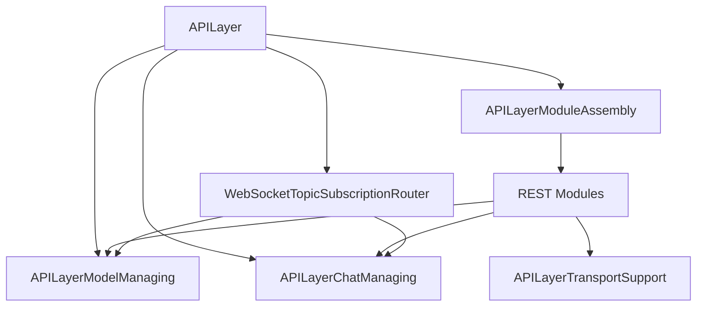
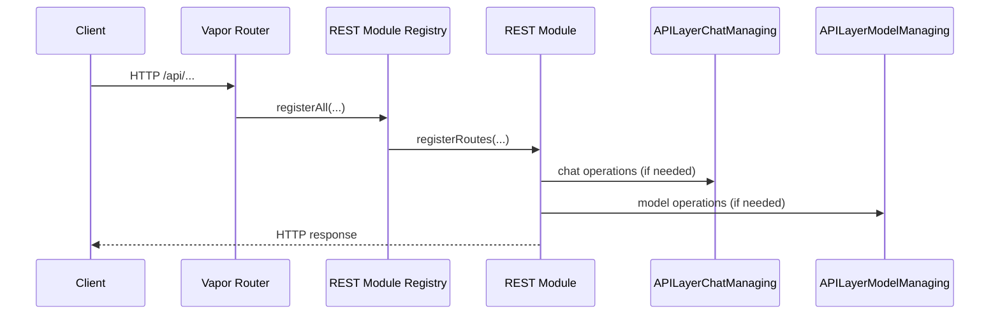
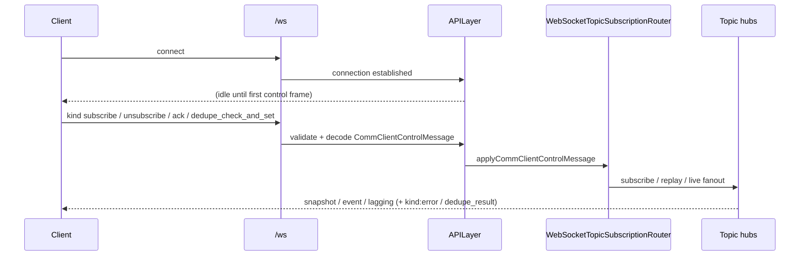

# Client–server API wire contract

This document describes the **public wire contract** between a harness client and server: REST under `/api`, WebSocket on `/ws`, plus a few non-API routes. It is the narrative reference for client authors; pair it with [OpenAPI 3.1](../../../../../../openapi/openapi.yaml) and [ROUTE_INVENTORY.md](../../../../../../openapi/ROUTE_INVENTORY.md) for the complete route matrix and request/response schemas.

**Source of truth:** `APILayer.swift`, `APILayerRESTModules.swift`, `APILayerWebSocketModules.swift`, `APILayerTransportSupport.swift`, and request DTOs under [`Models/`](../../../../Models/). Shared wire payload types (for example `ModelInfo`, `ConversationServerMetadata`) live in the shared wire-types module consumed by client and server. Trigger message format and request shaping are documented in [`harness/Surfaces/Triggers/README.md`](../../../Surfaces/Triggers/README.md).

**Reference client:** a Swift reference client ships alongside the server package (WebSocket session + REST helpers). Use it as a worked example; the wire contract here and in OpenAPI is transport-agnostic.

**Communication layer migration:** harness compliance rundown + `APILayerChatManaging` seam inventory — [COMMUNICATION_LAYER_MIGRATION.md](../../../../../../Documentation/COMMUNICATION_LAYER_MIGRATION.md#harness-compliance-rundown).

**Communication Layer policy (topics, `seq`, `lagging`, harness envelopes):** normative technical reference — [COMMUNICATION_POLICY.md](../COMMUNICATION_POLICY.md). Use it for subscribe semantics and sequencing; this document stays the **public wire** narrative for REST paths and WebSocket contracts.

**Machine-readable contracts:** [OpenAPI 3.1](../../../../../../openapi/openapi.yaml) for `/api`, JSON Schemas under [openapi/schemas/ws/](../../../../../../openapi/schemas/ws/) for harness WebSocket envelopes, and an [AsyncAPI](../../../../../../openapi/asyncapi.yaml) adjunct for `/ws`. Route matrix and removed-route tombstones: [ROUTE_INVENTORY.md](../../../../../../openapi/ROUTE_INVENTORY.md). Prose in this file remains the narrative reference; freeze gates live in [openapi/FREEZE_CHECKLIST.md](../../../../../../openapi/FREEZE_CHECKLIST.md).

**Publish-path contract:** Runtime/API producers publish through Communication Layer facades only (`ModelPoolResourceTopicPublishing`, `ConversationTopicPublishing`, `ConversationStatePublishing`, `TraceTopicPublishing`, `SubAgentLifecyclePublishing`, `CapabilityRegistryPublishing`, `ConversationsRegistryPublishing`). Direct hub `broadcast*` calls are reserved for hub internals and targeted hub tests.

---

## Conventions

- **Base URL:** Server listens on a configured host/port (see server CLI / `APILayer` init). Paths below are relative to the origin (e.g. `http://<host>:<port>/api/...`).
- **JSON:** REST bodies and WebSocket text frames use JSON.
- **Dates (REST):** **`GET /api/conversations/:id`** and several other REST payloads encode `Date` fields with `JSONEncoder.dateEncodingStrategy = .iso8601` (ISO-8601 strings). **`GET /api/conversations`** (list) may still use Vapor defaults for some nested shapes—mirror a known-good client decoder or capture a response when in doubt.
- **UUIDs:** Conversation and model IDs are UUID strings unless noted.
- **Errors:** Many REST failure paths return a small JSON object `{"type":"error","message":"..."}` with a 4xx status. Some routes (notably compaction preview/compact auth failures) return plain text bodies instead. WebSocket control-plane errors use `{"kind":"error","message":"..."}`.
- **HTTP preconditions:** Key reads emit `ETag` and honor `If-None-Match` (**304** on match). Guarded mutations accept optional `If-Match` (conversation control-plane revision); mismatches return **412**, and strict precondition mode returns **428** when a required `If-Match` is missing.
- **Session semantics:** Conversation-scoped routes are explicit-id based; no REST/WS “select conversation” control-plane operation exists.
- **Authentication (strict tenancy):** When `ServerConfig.requireAuthenticatedTenantOnAPI` is true, mutating routes and tenant-scoped WS subscribe checks require **`Authorization: Bearer <JWT>`** (HS256; `sub` = owner account UUID). Configure `ServerConfig.apiAccessTokenHS256Secret` (and optional `apiAccessTokenIssuer` / `apiAccessTokenAudience`). `APILayer.start()` refuses to boot strict tenancy without a configured secret. **`X-SAH-Authenticated-Owner` is not trusted.** Reverse proxies must strip client-supplied `Authorization` and inject a validated harness JWT.

---

## Non-API routes

| Method | Path | Purpose |
|--------|------|---------|
| GET | `/` | Health text: `It works!` |
| GET | `/oauth/callback` | OAuth redirect handler. Query: `code`, `state`, `error`, `error_description`. Returns HTML (not JSON). |

---

## REST API (`/api`)

All listed routes are registered under the Vapor group **`/api`**.

### Status and prompts

| Method | Path | Request | Response |
|--------|------|---------|----------|
| GET | `/api/status` | — | `{"status":"running","sessions":<Int>}` — `sessions` is the conversation count. |
| GET | `/api/system_prompt/full` | Query: optional `userSystemPrompt`, optional `conversationID` (UUID) | `{"fullSystemPrompt":<String>}` |

### Models

| Method | Path | Response |
|--------|------|----------|
| GET | `/api/models` | `{"models":[ModelInfo,...]}` — `ModelInfo` includes `id`, `modelName`, `modelProtocol`, `capabilities`. Supports `If-None-Match` with `304 Not Modified` and emits `ETag` on `200`. |
| POST | `/api/models/query` | `QueryModelsResponse` (`matches: ModelInfo[]`) from `modelRef` / `modelID` / `idOrQuery` input. Supports `If-None-Match` / `ETag`. |
| GET | `/api/models/:id/state` | `ModelStateResponse` when model invocation coordinator is available; **400** when id is invalid or state is unavailable. |
| GET | `/api/models/:id/calls` | Recent model call summaries for the given model id. |
| GET | `/api/models/:id/calls/events` | Model call event stream backfill for the given model id. |

Live model-pool observation also uses WebSocket topics `pool/health`, `models/registry`, and `model/{uuid}/state`.

### Messages (conversation-scoped)

| Method | Path | Response |
|--------|------|----------|
| GET | `/api/conversations/:id` | `ModelConversation` (includes `messages`). Optional query `includeDerived` (`true`/`1`/`yes`) returns derived projection fields when supported. Supports `ETag` / `If-None-Match`. |

| Method | Path | Body | Response |
|--------|------|------|----------|
| POST | `/api/conversations/:id/messages` | **`ChatRequest`** (JSON) | **`201`** `AppendInputResponse` (`runId`, `messageId`) — see [Send vs stream](#send-vs-stream-rest-mutation-vs-websocket-topics). |

**`ChatRequest`** ([`Models/ChatRequest.swift`](../../../../Models/ChatRequest.swift)):

| Field | Type | Notes |
|-------|------|--------|
| `conversationID` | `String?` | Legacy request field (ignored); routing uses path `:id`. |
| `message` | `String` | User text. |
| `imageNames` | `[String]` | Blob refs from **`POST /api/upload`** (`blobId`, `blob://…`, or 64-char hex). When session blob storage is configured (server deployments), temp-dir filenames are not accepted. Without blob storage (desktop), only validated single-segment filenames under the system temp directory are resolved. |
| `includeTools` | `Bool?` | Default **true** if omitted (`!= false`). |
| `includeAgents` | `Bool?` | Default **true** if omitted (`!= false`). |
| `expectedPreviousTailHarnessMessageID` | `UUID?` | Optional optimistic tail guard when `If-Match` is omitted. |
| `inputTrust` | `String?` | Optional user-input trust class (same semantics as SwiftAgentKit `inputTrust`). |

Canonical clients append via REST and observe assistant deltas on WebSocket topic `conversation/{id}/events`.

Replay remains an internal runtime capability; temporal replay control endpoints are not part of the public communication-layer HTTP contract.

### Triggers

Trigger ingress is a runtime boundary, not a Communication Layer contract requirement.
API trigger ingress routes are removed. External entities should not call the server API directly
for trigger dispatch; they are expected to flow through an ingress gate that performs idempotency
(Trigger.id + TTL dedupe), per-source/route rate limiting, authorization, and cost-ceiling checks
before dispatch.

### Upload (images / attachments)

| Method | Path | Body | Headers | Response |
|--------|------|------|---------|----------|
| POST | `/api/upload` | Raw **file bytes** (request body) | **Required:** `X-File-Name` (original name), `Content-Type` | `{"filename":<String>,"size":<Int>,"contentType":<String>,"filePath":<String>?,"blobId":<String>?}` — use **`filename`** (or blob path/id) in `ChatRequest.imageNames`. |

When session blob storage is configured, the server stores bytes in the session blob store and returns `blobId` plus a blob `filePath`. Otherwise the file is written under the system temporary directory with a UUID-prefixed name.

### Exec approvals (process-scoped)

| Method | Path | Body | Response |
|--------|------|------|----------|
| POST | `/api/exec-approvals/:id` | `{"approved":<Bool>,"durable":<Bool>?,"reason":<String>?}` | **200** on success; **400** + error JSON for invalid id/body; **404** when the approval id is unknown. |

### Conversations

| Method | Path | Response / notes |
|--------|------|------------------|
| GET | `/api/conversations` | Always **`PagedConversationsResponse`** (`items`, `totalCount`, `nextOffset`) with **`ConversationListSummary`** rows. Optional query keys: `limit`, `offset`, `search`, `lifecycle`, `sort`, `includeArchived`, `includeDeleted`, `updatedAfter`, `updatedBefore`, `summary`, `owner`, `parentConversationID`. See **Dates (REST)** for list vs full-model date encoding. |
| GET | `/api/conversations/:id/events?since=` | Persisted transcript backfill for `conversation/{id}/events` (`conversationID`, `since`, `latestSeq`, `lagging`, `events[]` JSON envelope lines). Optional `If-None-Match`. |
| GET | `/api/search` | Cross-conversation message search. Query: `q`, `kind`, `limit`, `offset`, optional `owner`, `includeArchived`, `includeDeleted`. Returns **`ConversationSearchResponse`**. |
| GET | `/api/conversations/:id/checkpoints/latest` | Latest valid checkpoint for `kind` query (`context_compaction`, `memory_injection_snapshot`, `tool_result_trim`, `system_prompt_assembly`); defaults to compaction when omitted. Returns shared wire DTO or **404**. |
| PATCH | `/api/conversations/:id` | **`ConversationPatch`** (partial update) + optional `If-Match`. **200** **`ConversationPatchResponse`** (`type`, `controlPlaneRevision`); **409** on revision/mode conflicts; **412/428** on precondition failures. |
| GET | `/api/conversations/:id` | Single `ModelConversation` JSON (includes optional `metadata` JSON object when set); **404** if missing. See [Messages](#messages-conversation-scoped) for `includeDerived`. |
| GET | `/api/conversations/:id/server-metadata` | **`ConversationServerMetadata`**: server-computed fields only — today `contextCompactionGating` (compaction token line, heuristics, `enableContextTransform` / `contextCompactionConfigEnabled`). **Not** the user-editable `metadata` object on a conversation (that is updated via `PATCH /api/conversations/:id`). **404** if the conversation is missing. |
| GET | `/api/conversations/select/:id` | Removed (returns 404). |

| Method | Path | Body | Response |
|--------|------|------|----------|
| POST | `/api/conversations` | **`ConvoRequest`** | On success: JSON `{"type":"create","conversationID":"<uuid>"}`. Invalid/unknown model reference returns **400** + `{"type":"error","message":"..."}`. |
| PUT | `/api/conversations/:id/metadata` | Removed (replaced by `PATCH /api/conversations/:id`) | `404` not found |
| PUT | `/api/conversations/:id/tool-overrides` | Removed (replaced by `PATCH /api/conversations/:id` + `ConversationPatch.disabledToolNames`) | `404` not found |
| PUT | `/api/conversations/:id/skill-overrides` | Removed (replaced by `PATCH /api/conversations/:id` + `ConversationPatch.disabledSkillNames`) | `404` not found |
| PUT | `/api/conversations/:id/thinking-preference` | Removed (replaced by `PATCH /api/conversations/:id` + `ConversationPatch.routingModelOptions.thinkingConfig`) | `404` not found |
| PUT | `/api/conversations/:id/reasoning-effort` | Removed (replaced by `PATCH /api/conversations/:id` + `ConversationPatch.routingModelOptions.thinkingConfig`) | `404` not found |
| DELETE | `/api/conversations/:id` | Query: optional **`hard`** (default **true**). **`hard=false`** performs a soft delete (lifecycle **deleted**); **`hard=true`** removes the conversation row. | **200** on success; **404** + error JSON on failure. |
| POST | `/api/conversations/:id/preview-context-compaction` | Optional JSON body (see below) | **Only if** the server enables this route **and** sets a non-empty preview token. **Required header:** `X-SAH-Context-Compaction-Preview-Token` must match the configured token. Runs the same context-compaction pipeline as a real turn but **does not** persist checkpoints or update cooldown state. **404** if the feature is disabled; **403** if enabled but no token is configured; **401** if the header is wrong; **404** if the conversation id is unknown. Response body: see **Context compaction preview** below. |
| POST | `/api/conversations/:id/compact` | Optional JSON body (see below) | **Only if** `contextCompaction.manualRESTEnabled` is true in `PromptConfig.json` **and** the preview token is set (auth header is reused). Runs the same context-compaction pipeline **and persists** a checkpoint + cooldown timestamp. **404** if disabled; **403** if no token is configured; **401** if the header is wrong; **404** if the conversation id is unknown. Response body: see **Manual context compaction** below. |

**`ConvoRequest` / metadata** — see [`Models/ConvoRequest.swift`](../../../../Models/ConvoRequest.swift):

- `ConvoRequest`: preferred `modelRef` (UUID or slug), deprecated fallback `modelID`, optional `userSystemPrompt`, `topic`, `description`, `metadata` (arbitrary JSON object), `interactionMode` (`"chat"` | `"plan"` | `"agent"`), optional `modeProfileID`.
- `ConversationPatch`: partial control-plane mutation payload for metadata, lifecycle, mode, model/prompt, tool/skill overrides, thinking/reasoning preferences, and optional `modeProfileID` / `expectedRevision`.

#### Context compaction preview

**Enable** via `ServerConfig` / server CLI: `--enable-context-compaction-preview` and `--context-compaction-preview-token <secret>` (or environment variable `SAH_CONTEXT_COMPACTION_PREVIEW_TOKEN`). If the route is enabled but no token is configured, the server responds **403** on that path.

**Request body (optional JSON):** `forceRunCompactionLLM` (`Bool`, default false) bypasses compaction-LLM cooldown and the middle minimum-character gate; `ignoreTokenThreshold` (`Bool`, default false) bypasses the token-threshold early return so you can test small transcripts.

**Response JSON:** `originalMessages`, `compactedMessages` (null if the LLM was not run), `diagnostics`, `messageProvenance` (array of `transformedMessageID`, `origin` string `original` \| `synthesized`, `sourceMessageIDs`), `noopReason` (string when gating skipped the LLM).

This endpoint **invokes the compaction model** and returns full message text — use only on trusted networks (e.g. localhost).

#### Manual context compaction

**Enable** via `PromptConfig.json` (`contextCompaction.manualRESTEnabled = true`, default true). The route reuses `contextCompactionPreviewToken` for auth — if no token is set, the server responds **403** on that path.

**Request body (optional JSON):** `reason` (`String`) — one-shot replacement for `compactionCustomInstructionsBlock` for this run only. Never persisted into the global config.

**Response JSON:** `originalMessages`, `compactedMessages` (null if the LLM was not run, e.g. cooldown), `diagnostics`, `messageProvenance` (same shape as preview), `noopReason` (string when gating skipped the LLM), `persisted` (Bool — true when a checkpoint + cooldown timestamp were written), `promptTokens` and `thresholdTokens` (snapshot at the time of the call).

Unlike preview, this endpoint **mutates server state**: a successful run writes a checkpoint event and updates the per-conversation cooldown timestamp, exactly like the production agent-loop path.

#### CLI: SwiftData store path and read-only

**`--data-store-path <path>`** — use that file URL as the SwiftData store (tilde expansion supported) instead of the default Application Support location.

**`--swift-data-read-only`** — opens the store with `allowsSave: false`. If SQLite write-ahead logging or side files cause errors when opening a copied production database, copy the store file **and** any `-wal` / `-shm` peers to a writable scratch directory, or use a non-WAL export, then point `--data-store-path` at the copy.

### Conversation sub-resources

| Method | Path | Notes |
|--------|------|--------|
| GET | `/api/conversations/:id/plan` | **200** `{"markdown":<String>}` when readable. Invalid `:id` → **400** (plain text body). Missing/unreadable plan → **404** + error JSON. |
| GET | `/api/conversations/:id/slash-commands` | **200** `[SlashCommandAutocompleteEntry]` for the conversation context. |

### Conversation control, runs, and artifacts

| Method | Path | Body | Response / notes |
|--------|------|------|------------------|
| POST | `/api/conversations/:id/revert` | `ConversationRevertRequest` + optional `If-Match` | Chunked assistant stream (**200**); see [Send vs stream](#send-vs-stream-rest-mutation-vs-websocket-topics). **409** transcript/run conflicts before stream commit. |
| POST | `/api/conversations/:id/branch` | `ConversationBranchRequest` + optional `If-Match` | **`ConversationBranchResponse`** (split/branch). |
| POST | `/api/conversations/:id/cancel` | `CancelConversationRunRequest` (`runId`) + optional `If-Match` | **200** `CancelConversationRunResponse` (idempotent cancel); **409** when run is not in flight. |
| POST | `/api/conversations/:id/tool-approvals` | `ToolApprovalResolutionRequest` | **200** or structured `type:error` (**400/404/501**). |
| POST | `/api/conversations/:id/completion-announcements` | `CompletionAnnounceTriggerRequest` | `CompletionAnnounceTriggerResponse` or structured `type:error` (**400/404/501**). |
| POST | `/api/conversations/:id/projection` | projection request body | Projected messages + metadata JSON. |
| POST | `/api/conversations/:id/checkpoints` | `ConversationCheckpointInvalidateRequest` | Checkpoint invalidation mutation (replaces removed `.../checkpoints/invalidate`). |
| GET | `/api/conversations/:id/runs` | query `limit?`; optional `If-None-Match` | **`ConversationRunListResponse`**. |
| GET | `/api/conversations/:id/runs/:runId` | query `detail?` (`1`/`true`/`yes` → projection detail); optional `If-None-Match` | **`ConversationRunInfo`** or **404**. |
| POST | `/api/conversations/:id/runs/:runId/cancel` | optional `If-Match` | Same cancel semantics as `POST .../cancel`. |
| GET | `/api/conversations/:id/sub-agents/active` | — | **`ActiveSubAgentInvocationListResponse`**. |
| POST | `/api/conversations/:id/sub-agents/:lifecycleID/cancel` | — | Idempotent sub-agent cancel (**204**). Sub-agent spawn is not on the canonical HTTP control-plane contract. |
| GET | `/api/conversations/:id/engine-artifacts` | — | `EngineArtifactKeysResponse`. |
| GET | `/api/conversations/:id/engine-artifacts/:key` | — | Raw bytes (`application/octet-stream`) or **404**. |
| PUT | `/api/conversations/:id/engine-artifacts/:key` | raw body + optional `If-Match` | **204** on success; **413** when over configured max body size. |
| DELETE | `/api/conversations/:id/engine-artifacts/:key` | optional `If-Match` | **204** on success. |
| DELETE | `/api/conversations/:id/engine-artifacts` | optional `If-Match` | Bulk delete; **204** on success. |

### Capability registry reads

| Method | Path | Notes |
|--------|------|--------|
| GET | `/api/tools` | Global tool registry (`AvailableToolInfo[]`) with ETag / `If-None-Match` support (`304` on match). |
| GET | `/api/conversations/:id/tools` | Effective tools for the conversation (mode/routing/disabled filtered). |
| GET | `/api/skills` | Global skill registry (`AvailableSkillInfo[]`) with ETag / `If-None-Match` support (`304` on match). |
| GET | `/api/conversations/:id/skills` | Effective skills for the conversation (mode/routing/disabled filtered). |
| GET | `/api/sub-agents` | Global sub-agent registry rows (`SubAgentRegistryEntry[]`) with ETag / `If-None-Match` support (`304` on match). |
| GET | `/api/modes` | Global mode profile catalog (`{ profiles: ModeProfileDTO[] }`) with ETag / `If-None-Match` support (`304` on match). |
| POST | `/api/modes/reload` | — | **200** `{ "reloaded": <Int> }` after reloading mode profiles from disk/config. |
| GET | `/api/traces/:conversationId` | Conversation-scoped trace span set (`ConversationTraceResponse`), optional query `limit`. |

Orchestration/state snapshots are consumed via WebSocket topic `conversation/{id}/state` (REST snapshot helper routes are retired). Additional removed REST paths (404 tombstones) are listed in [ROUTE_INVENTORY.md](../../../../../../openapi/ROUTE_INVENTORY.md).

---

## Send vs stream (REST mutation vs WebSocket topics)

| Operation | REST | Streaming observation |
|-----------|------|------------------------|
| Send user message | `POST /api/conversations/:id/messages` → **`201`** `AppendInputResponse` | WebSocket `conversation/{id}/events` (`contentDelta`, `streamDone`, `messagesRefresh`, …) |
| Revert + regenerate | `POST /api/conversations/:id/revert` → chunked **`200`** assistant text (see below) | Same topic stream during/after revert |

### REST chunked revert stream

`POST /api/conversations/:id/revert` is the remaining chunked REST assistant stream route.

- **Success (`200`)**: Chunked assistant stream; chunks are **raw UTF-8 substrings** of the assistant reply (same stream as `partialContent` internally). There is **no** JSON framing per chunk; the client concatenates chunks to build the final text.
- **Send conflicts (`409`)**: Structured JSON body before stream commit:
  - `transcript_tail_mismatch` → `TranscriptTailConflictBody`
  - `run_in_progress` → `ConversationRunConflictBody`
- **Non-conflict failures (`500`/`400`)**: Route-level error response (not in-stream plain text).

Send (`POST .../messages`) returns anchors immediately; the server drains the runtime stream internally and publishes deltas on websocket topics. There is **no** chunked REST body for send.

There is **no** `turn_state` or structured message list on the revert REST stream (unlike historical websocket `type` responses).

---

## WebSocket (`/ws`)

- **URL:** `/ws` (same host/port as HTTP). Max frame size is set to `UInt32.max` in code.
- **Encoding:** Text frames, UTF-8 JSON.
- **Inbound:** Only harness control frames with **`kind`** are accepted (`subscribe` / `unsubscribe` / **`ack`** / **`dedupe_check_and_set`** — see [`comm-client-control.schema.json`](../../../../../../openapi/schemas/ws/comm-client-control.schema.json)). The server validates the object, then decodes **`CommClientControlMessage`** for multiplexed topics. **`ack`** carries cumulative **`upTo`** seq acknowledgements (see [COMMUNICATION_POLICY.md §6](../COMMUNICATION_POLICY.md)). **`dedupe_check_and_set`** returns `{"kind":"dedupe_result","firstSighting":...}` (see [COMMUNICATION_POLICY.md §1](../COMMUNICATION_POLICY.md)). Validation failures return `{"kind":"error","message":"..."}`. Legacy client **`type`** frames (for example `send_message`) are rejected during validation — typically **`Harness control message requires kind`** — and are not decoded. REST replacements: [SESSION_SCOPING.md](../../../../../../Documentation/SESSION_SCOPING.md).
- **Outbound flow control (optional):** When enabled via server configuration, harness **`event`** traffic can be credit-windowed using client **`ack`**; **`lagging`** with **`hint: "flow_pressure"`** may signal soft pressure; state-like topics may coalesce under load. Default deployment leaves this **off** (legacy throughput). Details: [COMMUNICATION_POLICY.md §6](../COMMUNICATION_POLICY.md).

### Connection lifecycle

1. On connect, the server does **not** emit an initial handshake frame; the socket is idle until the client sends control frames.
2. Server does not run a websocket-side "selected conversation" transcript hook on connect. Clients hydrate via explicit `kind: subscribe` topics (`conversation/{id}/events`).
3. On socket **close**, the server calls **`apiCancelMessageStream()`** for that session.

### Multiplexed topics (`kind` control frames)

Clients may send **`{"kind":"subscribe","topic":"<string>","since":<optional seq>}`**, **`{"kind":"unsubscribe","topic":"<string>"}`**, and **`{"kind":"ack","topic":"<string>","upTo":<seq>}`** (cumulative consume-through cursor when flow control is enabled — see [COMMUNICATION_POLICY.md §6](../COMMUNICATION_POLICY.md)). For **`subscribe`**, the server rejects unauthorized conversation/sub-agent/model-state topics with **`{"kind":"error","message":"Subscribe denied"}`** when the session cannot observe that resource (see [COMMUNICATION_POLICY.md §1](../COMMUNICATION_POLICY.md)). Topic replies use **`kind`**: **`snapshot`**, **`event`**, or **`lagging`**, each with **`topic`**, monotonic **`seq`**, and optional **`value`** / **`hint`** — same envelope family as model pool topics (`CommResourceTopicMessage` in server sources).

| Topic | Purpose |
|-------|---------|
| `pool/health`, `models/registry`, `model/{uuid}/state` | Model pool / scheduler / registry streams. |
| `tools/registry`, `skills/registry`, `sub-agents/registry` | Capability listings scoped by explicit subscribe `conversationId` (topic snapshots/events for the requested conversation context). **`value`** payload types: **`ToolsRegistryPayload`**, **`SkillsRegistryPayload`**, **`SubAgentsRegistryPayload`** — see [COMMUNICATION_POLICY.md](../COMMUNICATION_POLICY.md) §2. |
| `conversation/{uuid}/events` | Single ordered stream per conversation (streaming timeline). Envelopes always include top-level `seq`; transient frames additionally include `runId` / `turnOrdinal` correlation fields. **`value`** is **`ConversationTopicEventPayload`**: **`semanticKind`** (`messagesRefresh`, `contentDelta`, `streamDone`, `runtimeLifecycle`, `checkpoint`, `modelLifecycle`), optional **`jsonUTF8`**. |
| `conversation/{uuid}/state` | Coalesced conversation/session snapshot and **authoritative state-transition channel**. **`value`** is **`ConversationStatePayload`** (metadata strip including mode/profile pointer fields such as `interactionMode`, `modeProfileID`, plus **`orchestration`**, **`contextBudget`** derived from projection policy with orchestration fallback, **`sessionSelected`**, **`replayActive`**, **`exists`**). Orchestration transitions are consumed from this topic, not `conversation/{uuid}/events` — see [COMMUNICATION_POLICY.md](../COMMUNICATION_POLICY.md) §4. |
| `subagent/{conversationId}/{path}/events`, `subagent/{conversationId}/{path}/state` | Sub-agent lifecycle branch streams. **`value`** is **`SubAgentLifecycleTopicPayload`** and `conversationId` is the authorization scope key used by websocket topic subscription checks. |
| `trace/{conversationId}`, `trace/server` | Trace streams. **`value`** is **`TraceTopicPayload`**; `trace/{conversationId}` applies conversation visibility checks while `trace/server` is process-wide. Mode catalog invalidation is published as a `trace/server` span named `mode_registry_changed` so clients can refetch `GET /api/modes`. |

Server outbound frames are harness-shaped only: topic envelopes (`kind: snapshot|event|lagging`) plus control responses (`kind:error`, `kind:dedupe_result`).

For mode/profile control-plane mutations, REST remains canonical (`PATCH /api/conversations/{id}`), while WebSocket remains observer-only: subscribers consume mirrored updates on `conversation/{id}/state` and `conversations/registry` (registry metadata includes `interactionMode` and `modeProfileID`).

Sub-agent runtime layering mirrors Model Pool structure: registry/resolve at the pool boundary, admission via a pool scheduler seam (`SubAgentRunScheduling`), lifecycle coordination (`SubAgentInvocationLifecycleTracking`), actor-confined state store (`SubAgentLifecycleState` in `SubAgentSpawnService`), and resource publication (`SubAgentPoolResourceTopicPublishing`).

### Removed client `type` payloads (historical reference)

The server no longer decodes inbound **`type`** frames. The field list below documents removed client payload shapes only.

### Legacy WebSocket request fields (superset, removed)

| Field | Type | Used by |
|-------|------|---------|
| `type` | `String` | All requests (discriminator). |
| `message` | `String?` | Legacy removed send frames and other legacy payloads. |
| `list` | `[String]?` | Legacy removed send-frame image list payload. |
| `id` | `String?` | Conversation UUID or message UUID (depends on legacy `type`). |
| `sourceID` | `String?` | Legacy removed `copy_conversation` payload field. |
| `modelID` | `String?` | Deprecated fallback for model-addressed legacy requests. |
| `topic`, `description` | `String?` | Create metadata fields and removed spawn compatibility payload fields. |
| `interactionMode` | `String?` | Optional mode field on supported routes. |
| `includeTools`, `includeAgents` | `Bool?` | Removed `send_message` payload fields; default **true** if omitted in historical frames. |
| `metadata` | `[String:String]?` | Legacy removed `send_trigger_message` metadata payload. |
| `patch` | `ConversationPatch?` | Removed `patch_conversation` payload field. |

### WebSocket inbound `type` values (client → server, removed)

Legacy **`type`** frames fail control validation before dispatch (typically **`Harness control message requires kind`**). Use the REST or topic replacement in the third column.

**Model catalog:** use **`GET /api/models`** plus harness **`{"kind":"subscribe","topic":"models/registry"}`** (see multiplexed topics below) — **`type:list_models`** is removed.

**Conversation transcript over websocket:** use harness **`{"kind":"subscribe","topic":"conversation/<uuid>/events"}`**. Subscribe snapshots (and **`event`** deltas) publish **`semanticKind: messagesRefresh`** with UTF-8 JSON rows matching **`Message.toJSON(includeImageData:false, includeThumbData:true)`** (same projection as historical **`type: messages`**). **`GET /api/conversations/{id}`** is the explicit REST read path; websocket-native clients must hydrate via topic subscribe rather than substituting REST for live timeline updates.

| `type` | Required fields | REST / topic replacement |
|--------|-----------------|--------------------------|
| `select_conversation` | `id` = conversation UUID | Subscribe to `conversation/{id}/events` and `conversation/{id}/state`. |
| `create_conversation` | — | `POST /api/conversations`. |
| `copy_conversation` | — | Not on the canonical HTTP control-plane contract (internal host API only). |
| `delete_conversation` | — | `DELETE /api/conversations/{id}`. |
| `send_message` | — | `POST /api/conversations/{id}/messages`. |
| `revert_to_message` | — | `POST /api/conversations/{id}/revert`. |
| `split_conversation` | — | `POST /api/conversations/{id}/branch`. |
| `send_trigger_message` | — | Trigger-gate ingress (non-API) plus topic subscriptions. |
| `patch_conversation` | — | `PATCH /api/conversations/{id}`. |
| `stop_agent_build` | — | `POST /api/conversations/{id}/cancel`. |
| `spawn_sub_agent` | — | Not on the canonical HTTP control-plane contract (sub-agent lifecycle via REST cancel/list only). |
| `resolve_tool_approval` | — | `POST /api/conversations/{id}/tool-approvals`. |
| `push_completion_announce` | — | `POST /api/conversations/{id}/completion-announcements`. |

`list_conversations` has been retired from the websocket request/response surface. Conversation roster hydration is canonical via REST `GET /api/conversations` (paged/filtered list mode), with optional harness live updates on `conversations/registry` (`kind: subscribe`).

### WebSocket outbound (server → client)

Messages may be sent as JSON objects or JSON strings (both parseable as JSON text).

| `kind` | Shape | When |
|--------|-------|------|
| `snapshot` / `event` / `lagging` | `CommResourceTopicMessage` (`kind`, `topic`, `trustClass`, `originTrust`, optional `seq`, optional `value`, optional `hint`) | Topic subscribe snapshots, live events, replay lagging hints with canonical trust tagging on each frame. |
| `error` | `{"kind":"error","message":"...", ...optional code}` | Control-plane validation failures and subscribe routing errors. |
| `dedupe_result` | `{"kind":"dedupe_result","firstSighting":true\|false}` | Response to `kind: dedupe_check_and_set`. |

Image attachments for sends use **`POST /api/upload`** filenames in **`ChatRequest.imageNames`** on the REST append route.

### Embedded / in-process mode

Embedded mode uses the same communication-layer hubs and harness envelopes as `/ws`, delivered through in-process subscriber channels.

- Topic-scoped subscribe/unsubscribe is available for model, conversation, state, registry, and sub-agent lifecycle topics.
- Subscribe follows reconcile-and-watch semantics: replay when possible, `lagging` when needed, then `snapshot`, then live `event`.
- Lockstep migration contract: there is no legacy embedded fallback path; client/server move together on one canonical communication contract.
- WebSocket `ack` credit-window behavior remains WS-transport-specific; in-process delivery is not currently `ack`-throttled.

---

## Internal module layout (for server contributors)

- `APILayer.swift` — Vapor app, `/api` + `/ws`, OAuth route, WebSocket lifecycle and control-frame handling.
- `APILayerModuleAssembly.swift` — REST module registry (`restModules()`).
- `APILayerRESTModules.swift` — REST route registration and handlers (status, models, conversations, capabilities, traces, messages, upload, exec-approvals).
- `APILayerWebSocketModules.swift` — `APILayerWebSocketDependencies` (shared WS handler dependencies).
- `APILayerTransportSupport.swift` — harness error/dedupe payloads and `streamingChatResponse` (chunked REST revert stream).
- `../WebSocketTopicSubscriptionRouter.swift` — subscribe/unsubscribe routing to communication-layer topic hubs (invoked from `APILayer` WebSocket handlers).

### Persistence and API seams

Conversation disks live behind **`ConversationPersistenceDomain`**, which owns **`ConversationPersistenceStack`** / **`ConversationManager`** at startup and forwards **`routing*`** transcript/journal work during orchestration. The API boundary routes conversation protocol ownership through **`APILayerConversationAdapter`** (composed from `ConversationCatalogServicing`, `ConversationControlPlaneServicing`, `ConversationLifecycleServicing`, `ConversationRunsReplayServicing`, `ConversationHarnessUtilityServicing`, `ConversationResidualAPIServicing`, `ConversationToolModePolicyServicing`, `SubAgentLifecycleOrchestrationServicing`, `SubAgentCompletionIngressServicing`) and runtime protocol ownership through **`RuntimeStreamingOrchestrationService`** (`APILayerChatRuntimeManaging`) wired to **`AgentRuntimeSessionService`** + **`ConversationReplayService`**. Sub-agent API surfaces use **`SubAgentLifecycleOrchestrationService`** / **`SubAgentCompletionIngressService`** with spawn/completion services (`SubAgentAPIIngressService`).

### Dependency graph

### REST request flow

### WebSocket message flow

---

## Extension points

### New REST module

1. Implement `APILayerRESTEndpointModule` (see `APILayerRESTModules.swift`).
2. Register routes in `registerRoutes(on:dependencies:)`.
3. Append the module in `APILayerModuleAssembly.restModules()`.
4. Add an entry to [`openapi/route-tenancy-inventory.json`](../../../../../../openapi/route-tenancy-inventory.json) (and pass `APILayerTenancyGuardInvariantTests`) for mutating or conversation-scoped handlers.
5. Add tests.

### New harness topic or REST route

- **REST mutations** — add an `APILayerRESTEndpointModule` handler (or extend an existing conversations module route) and document it in [ROUTE_INVENTORY.md](../../../../../../openapi/ROUTE_INVENTORY.md) / OpenAPI.
- **WebSocket observation** — extend topic publishing/subscribe authorization in `../WebSocketTopicSubscriptionRouter.swift` and communication-layer hubs; inbound WS remains harness `kind` control only (do not add legacy client `type` frames).
- Add integration tests under the server package `Tests/` tree.

---

## Testing

- `configureRoutesForTesting(_:)` on `APILayer` registers the same routes on a test `Application`.
- Protocols `APILayerChatManaging` / `APILayerModelManaging` allow fakes/stubs.
- See the server package `Tests/` tree for REST, WebSocket, and streaming coverage.
- SwiftPM / CLI runner notes (locks, filters): [`Tests/README.md`](../../../../../../Tests/README.md).

---

## Design goals

- Centralized route composition; modular endpoint behavior; REST mutations + harness topic observation; incremental refactors with tests.
