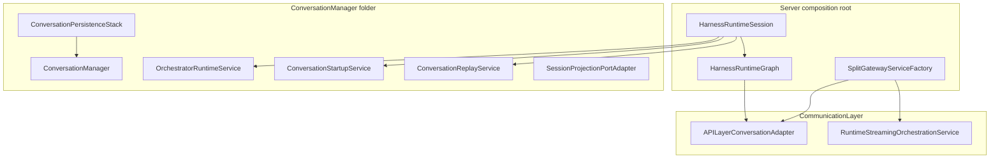

# Conversation Manager

This folder documents how this implementation maps to the harness **Conversation Manager** spec: the conversation as a first-class addressable resource (CRUD, branching, lifecycle, runs, persistence). Post-expansion (Slices 0–8 + L1), **`HarnessRuntimeSession`** is a **thin session coordinator** — selection mirror, injected service refs, and domain bundle access. REST/WebSocket clients reach conversation operations through the **Communication Layer** (`APILayerConversationAdapter`, `RuntimeStreamingOrchestrationService`), not through the session actor's internal methods.

## Architecture (post-expansion)

The composition root exposes `harnessRuntimeSession`. [`SplitGatewayServiceFactory`](../CommunicationLayer/API/SplitGatewayServiceFactory.swift) builds [`HarnessRuntimeGraph`](../CommunicationLayer/API/SplitGatewayServiceFactory.swift) → [`HarnessServiceGraph`](../CommunicationLayer/API/SplitGatewayServiceFactory.swift) → `APILayerConversationAdapter` + `ChatRuntimeService`.

## Boundary: session vs peeled services

| Concern | Owner | Not on session actor |
|--------|-------|----------------------|
| Session selection (`currentConversationID`, `currentMessages`) | [`ConversationSelectionRuntimeService`](ConversationSelectionRuntimeService.swift) via [`ConversationSelectionAccessAdapter`](HarnessRuntimeSelectionPort.swift) | Session holds delegates only |
| Session projection cache | [`SessionProjectionRuntimeService`](SessionProjectionRuntimeService.swift) via [`SessionProjectionPortAdapter`](SessionProjectionPort.swift) | Session holds delegates only |
| Turn loop / streaming terminal / generation task | [`AgentRuntimeSessionService`](../AgentRuntime/AgentRuntimeSessionService.swift) | Session implementation bodies |
| Model context assembly / compaction mutex | [`ContextProjectionService`](../ContextEngine/ContextProjectionService.swift) | Session |
| Tool gateway / slash / approval | [`ToolSystem/`](../ToolSystem/) services | Session |
| Sub-agent spawn / completion | [`SubAgentPool/`](../SubAgentPool/) services | Session |
| Orchestrator build / MCP / A2A | [`OrchestratorRuntimeService`](OrchestratorRuntimeService.swift), [`ConversationStartupService`](ConversationStartupService.swift) | Session main body |
| Replay coordinator + sandbox tasks | [`ConversationReplayService`](ConversationReplayService.swift) | Session |
| CRUD / branch / lifecycle / runs API | Domain `*ServiceImpl` + [`ConversationDomainServices.swift`](../../../Managers/ConversationDomain/ConversationDomainServices.swift) | Session public API |
| Durable catalog + transcript | [`ConversationPersistenceStack`](ConversationPersistenceStack.swift), [`ConversationManager`](ConversationManager.swift) | Context Engine |

Harness spec vocabulary (resource vs run, raw vs derived events): external template `core/conversation-manager/README.md`. Projection mapping for this codebase: [`../../../../../Documentation/PROJECTION.md`](../../../../../Documentation/PROJECTION.md).

## `HarnessRuntimeSession` — thin coordinator (L1)

Public contract: [`HarnessRuntimeSessionCoordinating`](HarnessRuntimeSessionCoordinating.swift) + [`HarnessRuntimeSessionWiring`](HarnessRuntimeSessionCoordinating.swift) (composition-root service refs).

| Surface | Purpose |
|---------|---------|
| `currentConversationID`, `currentMessages`, `selectConversation`, `currentConversation()` | Delegates to `ConversationSelectionRuntimeService` |
| `conversationDomainServices` | Gateway/tools/adapters use domain bundle — not internal session methods |
| `runtimeDependencies` | Single read path for config and shared infra (`ConversationRuntimeDependencies`) |
| Session projection reads/writes | Cross-actor via `SessionProjectionPortAdapter` → `SessionProjectionRuntimeService` |
| Orchestrator port surface (mode policy, listeners, context recovery) | `OrchestratorSessionPortAdapter` → `OrchestratorSessionRuntimeService` |
| `sessionOrchestrator()`, `sessionOrchestratorConversationID()` | Diagnostics only |

**Refs held on session (wiring, not behavior):** `agentRuntimeSessionService`, `orchestratorRuntimeService`, `conversationMessagingRuntimeService`, `contextProjectionService`, tool/sub-agent/runtime-lifecycle/startup services, `persistenceDomain`, `conversationManager`.

**Extension files** (organizational; `internal` — not the public API):

| File | Role |
|------|------|
| [`HarnessRuntimeSession.swift`](HarnessRuntimeSession.swift) | Core actor, init, selection mirror, domain wiring |
| [`HarnessRuntimeSession+OrchestratorRuntimeBridge.swift`](HarnessRuntimeSession+OrchestratorRuntimeBridge.swift) | Orchestration snapshot/token bridges to `AgentRuntimeSessionService` |
| [`HarnessRuntimeSession+Messaging.swift`](HarnessRuntimeSession+Messaging.swift) | Selection/message-stream delegates to `ConversationSelectionRuntimeService` |
| [`HarnessRuntimeSession+Testing.swift`](HarnessRuntimeSession+Testing.swift) | Test SPI |
| [`RuntimeSessionLifecycleSupport.swift`](RuntimeSessionLifecycleSupport.swift) | Topic publish, terminal/streaming session bridges |
| [`RuntimeMessagingSessionBridge.swift`](RuntimeMessagingSessionBridge.swift) | Thin forwards to `ConversationMessagingRuntimeService` |
| [`ConversationMessagingRuntimeService.swift`](ConversationMessagingRuntimeService.swift) | Append, registry sync, persistence applicator |

Session size metrics (refresh with `python3 scripts/measure_harness_runtime_session.py` from the server package root): as of 2026-06-20, main **`HarnessRuntimeSession.swift`** is **1,115** lines; **2,000** total across the measured `HarnessRuntimeSession*` set; **0** AC2 host-prefix callbacks.

## Service inventory (this folder)

| Type | Role |
|------|------|
| [`ConversationRuntimeDependencies`](ConversationRuntimeDependencies.swift) | Composition-root config/infra bag passed into runtime services |
| [`SessionProjectionPort.swift`](SessionProjectionPort.swift) | `Sendable` port for session projection cache mutations |
| [`ConversationSelectionRuntimeService.swift`](ConversationSelectionRuntimeService.swift) | Active selection mirror, message-stream bridge, lane/trust helpers |
| [`SessionProjectionRuntimeService.swift`](SessionProjectionRuntimeService.swift) | UI projection cache and publish frontier state |
| [`OrchestratorSessionRuntimeService.swift`](OrchestratorSessionRuntimeService.swift) | Orchestrator port surface: mode policy, listener lifecycle, context recovery, transition hooks |
| [`OrchestratorRuntimeService`](OrchestratorRuntimeService.swift) | `SwiftAgentKitOrchestrator` construction, tool manager, MCP/A2A shutdown |
| [`ConversationStartupService`](ConversationStartupService.swift) | Publisher/MCP/A2A/resource wiring, retention sweeps, catalog reset, shutdown entry |
| [`ConversationReplayService`](ConversationReplayService.swift) | Replay tasks, sandbox/source IDs, finalize |
| [`ConversationCatalogServiceImpl`](ConversationCatalogServiceImpl.swift) | List/read/search/project catalog API bodies |
| [`ConversationControlPlaneServiceImpl`](ConversationControlPlaneServiceImpl.swift) | Patch, create, routing, system-prompt compose |
| [`ConversationLifecycleServiceImpl`](ConversationLifecycleServiceImpl.swift) | Delete, branch, copy, checkpoint invalidation, artifacts |
| [`ConversationRunsReplayServiceImpl`](ConversationLifecycleServiceImpl.swift) | Run list/detail/cancel API bodies |
| [`ConversationResidualAPIServiceImpl`](ConversationLifecycleServiceImpl.swift) | Trace/plan/orchestration/sub-agent read surfaces |
| [`ConversationHarnessUtilityServiceImpl`](ConversationLifecycleServiceImpl.swift) | Harness utility reads (slash commands, compaction gating flags, etc.) |
| [`ConversationDomainServiceFactory`](ConversationLifecycleServiceImpl.swift) | Wires domain bundle for `HarnessRuntimeGraph` |
| [`AgentRuntimeOrchestrationCore`](../AgentRuntime/AgentRuntimeOrchestrationCore.swift) | Early-wirable orchestrator binding, lifecycle, token, and residual emission state shared by pre-ARSS services and delegated from `AgentRuntimeSessionService` |
| [`ConversationPersistenceStack`](ConversationPersistenceStack.swift) | `ModelContainer`, `ConversationManager`, event log, `DerivedEventStore` |
| [`ConversationPersistenceDomain`](ConversationPersistenceDomain.swift) | Composition-root persistence facade |
| [`HarnessRuntimeSessionFactory`](HarnessRuntimeSessionFactory.swift) | Composition-root wiring: creates `AgentRuntimeOrchestrationCore` first, unbound port adapters, domain bundle, then `AgentRuntimeSessionService`; uses explicit `install*` hooks for spawn, mode policy, run control, and tool collaborators (no `@unchecked` forward refs) |
| [`InteractionModes/`](InteractionModes/) | `ModeRegistryService` + `ModeRegistryAccessing` port, `ResolvedModeProfile`, thinking/routing resolution |

Tool/mode/skill API policy owner: [`ConversationToolModePolicyRuntimeService`](../ToolSystem/ConversationToolModePolicyRuntimeService.swift) (Slice I; wired as `HarnessRuntimeGraph.toolPolicyOwner`).

Runtime lifecycle topic fanout lives in [`RuntimeLifecyclePublicationService`](../CommunicationLayer/RuntimeLifecyclePublicationService.swift) (Communication Layer), injected at startup.

## API and gateway boundary

- Clients **do not** call `HarnessRuntimeSession` for REST or WebSocket operations.
- [`APILayerConversationAdapter`](../CommunicationLayer/API/APILayerConversationAdapter.swift) implements catalog, control-plane, lifecycle, runs-replay, residual, and tool-policy surfaces via `ConversationDomainServiceBundle`.
- Streaming sends and cancel run through [`RuntimeStreamingOrchestrationService`](../AgentRuntime/RuntimeStreamingOrchestrationService.swift) → `AgentRuntimeSessionService` + `ConversationReplayService`.
- Protocol definitions: [`ConversationDomainServices.swift`](../../../Managers/ConversationDomain/ConversationDomainServices.swift).

## Persistence boundary

[`ConversationPersistenceStack`](ConversationPersistenceStack.swift) is the composition-root owner of:

- Anchors-only SwiftData `ModelContainer`
- [`ConversationManager`](ConversationManager.swift) (in-process registry + harness session persistence)
- [`ConversationEventLogService`](ConversationEventLogService.swift) (raw journal markers)
- [`DerivedEventStore`](../ContextEngine/DerivedEventStore.swift) routing (derived journal / checkpoints)

All durable mutations go through [`ConversationPersistenceDomain`](ConversationPersistenceDomain.swift) (actor). **Single-writer assumption:** one server process owns a given `SAH_SESSION_STORE_ROOT`; SQLite catalog + JSONL transcripts are reached only via this actor stack, with per-conversation transcript locks and one active run per session. Cross-process pid+starttime lockfiles ([`ProcessAwareTranscriptWriteLock`](../../Backends/Persistence/Local/ProcessAwareTranscriptWriteLock.swift)) matter only when a second process (CLI alongside server, external repair) writes the same store — see [Backends/Persistence/README.md](../../Backends/Persistence/README.md).

Append path: stack → transcript lock → catalog + JSONL. Search/branch/projection extensions: `ConversationManager+Search`, `+BranchJournal`, `+Projection`, `+JournalV2`, etc.

**Two projections** (do not conflate): UI turn-summary overlay vs model-facing context assembly — see [`../ContextEngine/README.md`](../ContextEngine/README.md) and [`../../../../../Documentation/PROJECTION.md`](../../../../../Documentation/PROJECTION.md).

## Shutdown and task lifetime

Ordered shutdown (`HarnessRuntimeSession.shutdownOrchestratorAndToolRuntimes` → `ConversationStartupService.shutdownOrchestratorAndToolRuntimes`):

1. Stop sub-agent completion handoff owner (`SubAgentSpawnService` via startup spawn install)
2. Cancel replay tasks (`ConversationReplayService.cancelAllActiveTasks`)
3. Snapshot in-flight `generationTask`, cancel generation (`AgentRuntimeSessionService`)
4. Shutdown MCP/A2A tool runtimes (`OrchestratorRuntimeService.shutdownToolRuntimes`), clear orchestrator binding
5. `await` the snapshotted generation task if present

Long-lived task spawners use `[weak self]` on actor services. Coverage: `HarnessRuntimeSessionShutdownDrainTests` in the server package test target.

## Related modules

- **Agent Runtime:** [`../AgentRuntime/README.md`](../AgentRuntime/README.md) — inner turn loop, streaming terminal, orchestrator binding
- **Context Engine:** [`../ContextEngine/README.md`](../ContextEngine/README.md) — model-facing assembly, compaction, checkpoint producers
- **Tool System:** [`../ToolSystem/README.md`](../ToolSystem/README.md) — gateway, slash, approval (Slice I peeled off session)
- **Sub-Agent Pool:** [`../SubAgentPool/README.md`](../SubAgentPool/README.md) — spawn/completion, A2A wiring via `ConversationStartupService`
- **Communication Layer:** [`../CommunicationLayer/API/ARCHITECTURE.md`](../CommunicationLayer/API/ARCHITECTURE.md) — wire adapters and gateway split
- **Framework overview:** [`../../../../../Documentation/CORE_FRAMEWORK.md`](../../../../../Documentation/CORE_FRAMEWORK.md)

## Anti-patterns

- **Session as wire/gateway owner** — API contracts belong on split services and `APILayerConversationAdapter`, not `HarnessRuntimeSession` methods.
- **`unowned` host-box callbacks** — deleted (Item C); inject typed port protocols (`ConversationMessagingPort`, `OrchestratorSessionPort`, etc.) or direct deps.
- **Reading `services` off session without `await`** — `HarnessRuntimeSession.services` is actor-isolated; composition roots capture `HarnessRuntimeSessionFactory.Services` from `makeSession` / `makeProduction`.
- **Duplicating orchestrator or stream state on session** — single owners: `AgentRuntimeSessionService`, `OrchestratorRuntimeService` (slices B2, E, G).
- **Conflating UI projection with model context** — different consumers and event kinds; see PROJECTION.md.
- **Compaction mutating raw transcript** — derived checkpoints only; raw messages stay append-only per harness spec.
