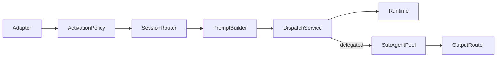

# Triggers

This folder implements the harness **Surfaces/Triggers** spec: non-interactive activation (cron, webhooks, file events, channels) through a normalized `Trigger` pipeline.

Production wiring is assembled by **`TriggersRuntimeWiring`**. The host app supplies `TriggersRuntimeWiring.Configuration` (notably `dataDirectory`, optional `eventsDirectory`, and feature toggles) and injects the returned `TriggersRuntimeBundle` into its composition root alongside the agent runtime and Communication Layer.

## Pipeline



## Boundary: Communication Layer vs Triggers

| Concern | Communication Layer | Triggers surface |
|--------|---------------------|------------------|
| User typing in client UI | `POST /api/conversations/:id/messages` | N/A |
| Cron / webhook / file / channel ingress | Removed from API contract | **Trigger gate** → `TriggerDispatchService` |
| Idempotency | WS `dedupe_check_and_set` | `TriggerIdempotencyGate` (same persistence primitive) |
| Trust / provenance | `CommEnvelopeOriginTrust` on wire envelopes | Adapter sets trust; prompt builder wraps |

Trigger ingestion is **outside** Communication Layer scope. Interactive clients use the Communication Layer; automation surfaces use the trigger gate only.

## Service inventory

| Type | Role |
|------|------|
| `Trigger` / `TriggerSource` | Normalized activation object |
| `TriggerActivationPolicy` | Idempotency, rate limit, auth, cost ceiling |
| `TriggerSessionRouter` | Isolated / threaded / delegated session keys |
| `TriggerPromptBuilder` | Trust-dispatch prompt + provenance reminder (`known-party` envelope preamble on by default, configurable off) |
| `ExternalContentEnvelope` | Shared provenance primitive ([`cross-cutting/Provenance`](../../cross-cutting/Provenance/ExternalContentEnvelope.swift)); trigger prompts + tool-result middleware |
| `TriggerDispatchService` | Gate → runtime or delegated sub-agent handoff |
| `TriggerDelegatedDispatchService` | Spawn constrained sub-agent via SubAgentPool |
| `TriggerSymmetricOutputRouter` | Source-aware completion egress |
| `TriggerSchedulerService` | Cron/at/every task store + firer |
| `WebhookIngressAdapter` | HTTP validate-then-normalize → file queue or `Trigger` |
| `FileEventQueueService` | Watches `events/` directory; sole consumer when queue enabled |
| `TriggerWebhookRouteRegistrar` | Vapor routes outside `/api` |

## Host integration

At boot, the host app typically:

1. Resolves a **`dataDirectory`** for trigger configuration (webhook subscriptions, scheduled tasks, channel config, audit snapshots).
2. Optionally sets **`eventsDirectory`** or relies on `TRIGGER_EVENTS_DIR` / `{persistenceRoot}/events/`.
3. Calls `TriggersRuntimeWiring.resolve(...)` with runtime, dedupe, conversation-creation, and delegated sub-agent ports.
4. Registers webhook routes and starts the file-event watcher / channel listeners when enabled.
5. Installs channel lifecycle on the agent runtime: `orchestratorRuntime.installChannelRegistry(bundle.channelRegistry, holder: channelRegistryHolder, sessionLifecycleCoordinator: bundle.channelSessionLifecycleCoordinator)` after `installAgentRuntime`.

| `Configuration` field | Purpose |
|-----------------------|---------|
| `dataDirectory` | Root for `channels.json`, `scheduled_tasks.json`, `webhook_subscriptions.json`, `trigger_snapshots/`, `trigger_audit.jsonl`, channel locks/status |
| `eventsDirectory` | Override for file-event queue watch path |
| `fileEventQueueEnabled` | When true, webhooks enqueue instead of direct dispatch |
| `channelListenersEnabled` | Starts channel listener registry (default `false`) |
| `staticWebhookRoutes` | Boot-time webhook route table |

## Delegated routing (Step 13)

When `routingMode: .delegated`, triggers spawn a **constrained sub-agent** (async by default) instead of running the parent agent loop. Completion is delivered symmetrically:

| Source | Egress on completion |
|--------|----------------------|
| `channel` | Reply on same thread via channel listener |
| `webhook` | POST to `deliveryWebhookURL` |
| `cron` | Per `delivery` (`none` / `announce` / `webhook`) |
| `file-event` | Audit log only |

Configure on webhook routes, `channels.json`, or `ScheduledTask` rows:

- `routingMode`: `delegated`
- `delegate`: `TriggerDelegateProfile` (`subagentType`, `runInBackground`, …)
- `deliveryWebhookURL` (webhook/cron outbound)

Child runs use mode profile `trigger-delegate` (read-only tool surface, no recursion). Trigger hosts use `trigger-host` metadata stamped on the parent conversation.

**Provenance reminder (delegated):** Isolated/threaded routes inject the provenance reminder as an ephemeral system message via `TurnLoop` (`systemReminder` → `ephemeralSystemReminder`). Delegated sub-agents have no separate system-reminder channel at spawn, so `TriggerDelegatedDispatchService` prepends `systemReminder + "\n\n" + userMessageBody` into the sub-agent `prompt`. Parity would require an `ephemeralSystemReminder` field on `SubAgentSpawnRequest`; inline prepending is the intentional v1 deviation.

## File-event queue (Step 11)

When the file-event queue is enabled, producers drop paired files under `{eventsDirectory}/`:

```text
{eventsDirectory}/
├── foo.json              # event payload (immediate | one-shot | periodic)
├── foo.trust             # optional provenance sidecar
└── .processing/          # rename-on-read staging
```

Trust comes **only** from the `.trust` sidecar; missing sidecar → `unknown-party`. Producers write the `.trust` sidecar **before** the `.json` event so the watcher never sees an event without its trust. Webhooks write to the queue only (no direct `dispatch.ingest`) when the watcher is enabled.

Default events path: `TRIGGER_EVENTS_DIR` env, else `{persistenceRoot}/events/` (see `FileEventQueueLayout.resolveEventsDirectory`).

**Non-goal:** `HOOK.md` handler discovery (separate subsystem).

## Channel listeners (Step 12 framework)

Platform-agnostic intake pipeline under `Channel/`:

```text
transport → parse → instance lock → dedup → attachments → allowlist → mention gate → debounce → trust → Trigger
```

`channels.json` accepts all `ChannelTransportKind` values (`mock`, `slack`, `telegram`, `discord`, `email`). **Only `mock` is implemented today**; other kinds log `channel_transport_not_implemented` at startup and are skipped until platform PRs land. Trust comes from mechanical classification (`user-direct`, `known-party`, `unknown-party`, `system`), not message content.

Config: `{dataDirectory}/channels.json` with per-channel `auth`, `mention`, `debounce`, `dedupe` (`ttl_seconds`, default 3600), `primary_user`, optional `routing_mode` / `delegate`, and optional `include_known_party_security_preamble` (default `true`). Disabled by default (`channelListenersEnabled: false` in wiring).

Inbound dedupe uses the same persistence primitive as trigger idempotency and WS `dedupe_check_and_set` (host-provided `dedupeCheckAndSet` port → `cache/dedupe.sqlite`). Keys are namespaced `channel-intake:{channel}:{account}:{peer}:{session}:{platformMessageId}` so reconnect redelivery survives process restarts within the configured TTL window.

Runtime status: `{dataDirectory}/channel-status/{channel}.json` with stage counters and inflight debounce count.

**Follow-up platform PR checklist** (one PR per platform): add a `ChannelPluginFactory.build` branch returning transport (`ChannelTransport`), supervised listener (`ChannelSupervisedListening`), raw parser (`ChannelTransportRawEvent` → `ChannelMessageEvent`), outbound slot (native rich render), optional `sessionGrammar` / `security` overrides, transport-specific config fields, and fixture-based tests.

**Deferred:** live Slack/Telegram/Discord/Email SDK adapters, credential storage, attachment download over credentials.

## Trigger replay (Step 14)

`webhook test` equivalent for dry-run and end-to-end replay without contacting upstream sources. The harness ships [`TriggerReplayCLI`](Replay/TriggerReplayCLI.swift) and [`TriggerReplayHarness`](Replay/TriggerReplayHarness.swift); host apps embed or wrap them in their own CLI or test harness.

```bash
# Dry-run: render route template + prompt preview (JSON stdout)
<trigger-cli> webhook test <route> --payload '{"key":"value"}' --data-directory <dir> --json

# Fire via file-event queue (requires a running host with file-event watcher enabled)
<trigger-cli> webhook fire <route> --payload '{"key":"value"}' --json

# Replay captured artifacts
<trigger-cli> file replay <event.json>
<trigger-cli> snapshot replay <trigger.json>
<trigger-cli> audit replay <trigger-id>

# Cron on-demand fire
<trigger-cli> cron fire <task-id>
```

| Flag | Purpose |
|------|---------|
| `--data-directory` | Trigger config directory (`channels.json`, `scheduled_tasks.json`, …) |
| `--events-dir` | Override events directory |
| `--in-process` | Synchronous pipeline test without enqueue |
| `--json` | Machine-readable stdout |

Admitted triggers are snapshotted to `{dataDirectory}/trigger_snapshots/<id>.json` for audit replay.

### Cross-trigger correlation

Each `HarnessTrigger` may carry an optional `TriggerCorrelation` triad:

| Field | Meaning |
|-------|---------|
| `rootId` | First trigger in the logical workflow |
| `parentTriggerId` | Immediate causal parent (`nil` for roots) |
| `correlationId` | Shared workflow id (defaults to `rootId` for root triggers) |

Lineage is assigned at **creation time** in ingress builders, `schedule_create`, and file-event producers — not stamped after dispatch. Root triggers (webhook, channel, standalone cron/file) set `rootId = correlationId = trigger.id`. Scheduled follow-ups inherit from the host trigger fingerprint (via `schedule_create`) or from explicit `rootId` / `parentTriggerId` / `correlationId` fields on file-event JSON.

Durable query surfaces (no separate lineage store):

- **`trigger_audit.jsonl`** — every activation decision includes the triad; filter by `correlationId` to list all legs (including rate-limited and dedup-hit).
- **`trigger_snapshots/<id>.json`** — full trigger JSON for replay of any admitted leg.

Lineage is best-effort over audit retention; rotated audit rows drop early legs from reconstructable chains.

Default fire path enqueues to `{eventsDirectory}/replay-<uuid>.json`; the host's file-event watcher consumes it when the server process is running.

## Channels (Messaging-as-Interface)

Channel code is split across two surface trees:

| Tree | Role |
|------|------|
| [`Surfaces/Interface/Channel/`](../Interface/Channel/) | Surface contract: `ChannelSurfacePlugin`, outbound/presentation, streaming sink, message-tool delivery, approvals |
| [`Surfaces/Triggers/Channel/`](Channel/) | Inbound provenance: intake, trust, session grammar, transport, lifecycle; assembles `ChannelPlugin` from surface + trigger slots |

- **`ChannelPlugin`** (Triggers) — composed runtime record: `surface` + `security` + `sessionGrammar` + platform `listener`.
- **Core `message` tool** — registered in `OrchestratorRuntimeService.buildToolManager`; assistant prose always streams as `text_delta`. The `message` tool is additive for structured/native output (blocks, buttons, media). Channel and interactive turns use `MessageOutputPolicy.structuredPreferred` for prompt guidance.
- **Session grammar** — `ChannelSessionGrammar.resolveSessionConversation` + `parentFallbackCandidates` wired through `TriggerSessionRouter`.
- **Lifecycle helpers** — `ChannelTypingKeepalive`, `ChannelTransportSupervisor`, `ChannelSessionLifecycleCoordinator`. Session reset drains per-conversation tasks; channel `stop()` tears down transport separately.

See [`Interface/Channel/README.md`](../Interface/Channel/README.md) and [`Documentation/channels-phase0-spike-report.md`](../../../Documentation/channels-phase0-spike-report.md).

## Upcoming work (next steps)

| Step | Work |
|------|------|
| — | Tool-output provenance audit via `ToolResultExternalContentMiddleware` (see [`ToolSystem` README](../../core/ToolSystem/README.md)) |

**Step 15 (done):** All non-user, non-harness tool output is wrapped by `ToolResultExternalContentMiddleware` at runtime delivery order 200. Trigger inbound content continues to use `TriggerPromptBuilder` + the same `ExternalContentEnvelope` primitive.

## Trigger message format

Trigger messages are user-role messages that begin with a metadata line:

```text
[trigger] key1=value1; key2=value2

Message body text...
```

This format helps models distinguish automation-driven input (cron jobs, scripts, external agents) from live user chat.

### Codec utilities (in-tree)

| File | Role |
|------|------|
| [`Prompt/TriggerContentBuilder.swift`](Prompt/TriggerContentBuilder.swift) | Build/parse `[trigger]` metadata line + body |
| [`Prompt/Message+Trigger.swift`](Prompt/Message+Trigger.swift) | `Message` / `CachedMessage` read-side helpers |
| [`Scheduling/CronSchedule.swift`](Scheduling/CronSchedule.swift) | Five-field cron parsing + `nextDate(after:)` |
| [`HTTP/TriggerRESTRouteModule.swift`](HTTP/TriggerRESTRouteModule.swift) | `TriggerMessageRequest` + content preparation |

`TriggerPromptBuilder` calls `TriggerContentBuilder.buildFullContent` when assembling harness trigger prompts.

### Reading trigger content

- Full content is stored in `content` (`[trigger] ...` + blank line + message body).
- Parsed helpers: `triggerMetadata: [String: String]?`, `messageBodyContent: String`.
- Use metadata for UI display (source/type) and trust/auth decisions.

### Removed API ingress

All API/WebSocket trigger-ingress surfaces are removed from current contracts:

- `POST /api/messages/trigger` (removed)
- `POST /api/conversations/{id}/messages/trigger` (removed)
- WebSocket `type:send_trigger_message` (removed)

Trigger dispatch goes through the harness trigger gate (replay CLI, file-event queue, webhooks, cron, or channel listeners)—not through interactive client APIs.

## Related

- [`SubAgentPool`](../../core/SubAgentPool/README.md) — delegated spawn + completion machinery
