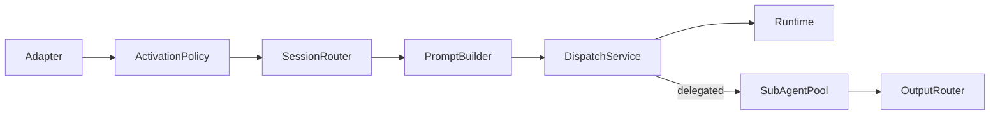

# Triggers

This folder implements the harness **Surfaces/Triggers** spec: non-interactive activation (cron, webhooks, file events, channels) through a normalized `Trigger` pipeline.

Production wiring is assembled by **`TriggersRuntimeWiring`**. The host app supplies `TriggersRuntimeWiring.Configuration` (notably `dataDirectory`, optional `eventsDirectory`, and feature toggles) and injects the returned `TriggersRuntimeBundle` into its composition root alongside the agent runtime and Communication Layer.

## Pipeline



## Boundary: Communication Layer vs Triggers

| Concern | Communication Layer | Triggers surface |
|--------|---------------------|------------------|
| User typing in client UI | `POST /api/conversations/:id/messages` | N/A |
| Cron / webhook / file / channel ingress | Removed from API contract | **Trigger gate** → `TriggerDispatchService` |
| Idempotency | WS `dedupe_check_and_set` | `TriggerIdempotencyGate` (same persistence primitive) |
| Trust / provenance | `CommEnvelopeOriginTrust` on wire envelopes | Adapter sets trust; prompt builder wraps |

Trigger ingestion is **outside** Communication Layer scope. Interactive clients use the Communication Layer; automation surfaces use the trigger gate only.

## Service inventory

| Type | Role |
|------|------|
| `Trigger` / `TriggerSource` | Normalized activation object |
| `TriggerActivationPolicy` | Idempotency, rate limit, auth, cost ceiling |
| `TriggerSessionRouter` | Isolated / threaded / delegated session keys |
| `TriggerPromptBuilder` | Trust-dispatch prompt + provenance reminder (`known-party` envelope preamble on by default, configurable off) |
| `ExternalContentEnvelope` | Shared provenance primitive ([`cross-cutting/Provenance`](../../cross-cutting/Provenance/ExternalContentEnvelope.swift)); trigger prompts + tool-result middleware |
| `TriggerDispatchService` | Gate → runtime or delegated sub-agent handoff |
| `TriggerDelegatedDispatchService` | Spawn constrained sub-agent via SubAgentPool |
| `TriggerSymmetricOutputRouter` | Source-aware completion egress |
| `TriggerRegistrationService` | **The one registration endpoint** — every create/update/delete, from every client |
| `TriggerSchedulerService` | Cron/at/every reader + firer. Does **not** register |
| `WebhookIngressAdapter` | HTTP validate-then-normalize → file queue or `Trigger` |
| `FileEventQueueService` | Watches `events/` directory; sole consumer when queue enabled |
| `TriggerWebhookRouteRegistrar` | Vapor routes outside `/api` |

## Host integration

At boot, the host app typically:

1. Resolves a **`dataDirectory`** for trigger configuration (webhook subscriptions, scheduled tasks, channel config, audit snapshots).
2. Optionally sets **`eventsDirectory`** or relies on `TRIGGER_EVENTS_DIR` / `{persistenceRoot}/events/`.
3. Calls `TriggersRuntimeWiring.resolve(...)` with runtime, dedupe, conversation-creation, and delegated sub-agent ports.
4. Registers webhook routes and starts the file-event watcher / channel listeners when enabled.
5. Installs channel lifecycle on the agent runtime: `orchestratorRuntime.installChannelRegistry(bundle.channelRegistry, holder: channelRegistryHolder, sessionLifecycleCoordinator: bundle.channelSessionLifecycleCoordinator)` after `installAgentRuntime`.

| `Configuration` field | Purpose |
|-----------------------|---------|
| `dataDirectory` | Root for `channels.json`, `scheduled_tasks.json`, `webhook_subscriptions.json`, `trigger_snapshots/`, `trigger_audit.jsonl`, channel locks/status |
| `eventsDirectory` | Override for file-event queue watch path |
| `fileEventQueueEnabled` | When true, webhooks enqueue instead of direct dispatch |
| `channelListenersEnabled` | Starts channel listener registry (default `false`) |
| `staticWebhookRoutes` | Boot-time webhook route table |

## Delegated routing (Step 13)

When `routingMode: .delegated`, triggers spawn a **constrained sub-agent** (async by default) instead of running the parent agent loop. Completion is delivered symmetrically:

| Source | Egress on completion |
|--------|----------------------|
| `channel` | Reply on same thread via channel listener |
| `webhook` | POST to `deliveryWebhookURL` |
| `cron` | Per `delivery` (`none` / `announce` / `webhook`) |
| `file-event` | Audit log only |

Configure on webhook routes, `channels.json`, or `ScheduledTask` rows:

- `routingMode`: `delegated`
- `delegate`: `TriggerDelegateProfile` (`subagentType`, `runInBackground`, …)
- `deliveryWebhookURL` (webhook/cron outbound)

Child runs use mode profile `trigger-delegate` (read-only tool surface, no recursion). Trigger hosts use `trigger-host` metadata stamped on the parent conversation.

**Provenance reminder (delegated):** Isolated/threaded routes inject the provenance reminder as an ephemeral system message via `TurnLoop` (`systemReminder` → `ephemeralSystemReminder`). Delegated sub-agents have no separate system-reminder channel at spawn, so `TriggerDelegatedDispatchService` prepends `systemReminder + "\n\n" + userMessageBody` into the sub-agent `prompt`. Parity would require an `ephemeralSystemReminder` field on `SubAgentSpawnRequest`; inline prepending is the intentional v1 deviation.

## File-event queue (Step 11)

When the file-event queue is enabled, producers drop paired files under `{eventsDirectory}/`:

```text
{eventsDirectory}/
├── foo.json              # event payload (immediate | one-shot | periodic)
├── foo.trust             # optional provenance sidecar
└── .processing/          # rename-on-read staging
```

Trust comes **only** from the `.trust` sidecar; missing sidecar → `unknown-party`. Producers write the `.trust` sidecar **before** the `.json` event so the watcher never sees an event without its trust. Webhooks write to the queue only (no direct `dispatch.ingest`) when the watcher is enabled.

Default events path: `TRIGGER_EVENTS_DIR` env, else `{persistenceRoot}/events/` (see `FileEventQueueLayout.resolveEventsDirectory`).

**Non-goal:** `HOOK.md` handler discovery (separate subsystem).

## Channel listeners (Step 12 framework)

Platform-agnostic intake pipeline under `Channel/`:

```text
transport → parse → instance lock → dedup → attachments → allowlist → mention gate → debounce → trust → Trigger
```

`channels.json` accepts all `ChannelTransportKind` values (`mock`, `slack`, `telegram`, `discord`, `email`). **Only `mock` is implemented today**; other kinds log `channel_transport_not_implemented` at startup and are skipped until platform PRs land. Trust comes from mechanical classification (`user-direct`, `known-party`, `unknown-party`, `system`), not message content.

Config: `{dataDirectory}/channels.json` with per-channel `auth`, `mention`, `debounce`, `dedupe` (`ttl_seconds`, default 3600), `primary_user`, optional `routing_mode` / `delegate`, and optional `include_known_party_security_preamble` (default `true`). Disabled by default (`channelListenersEnabled: false` in wiring).

Inbound dedupe uses the same persistence primitive as trigger idempotency and WS `dedupe_check_and_set` (host-provided `dedupeCheckAndSet` port → `cache/dedupe.sqlite`). Keys are namespaced `channel-intake:{channel}:{account}:{peer}:{session}:{platformMessageId}` so reconnect redelivery survives process restarts within the configured TTL window.

Runtime status: `{dataDirectory}/channel-status/{channel}.json` with stage counters and inflight debounce count.

**Follow-up platform PR checklist** (one PR per platform): add a `ChannelPluginFactory.build` branch returning transport (`ChannelTransport`), supervised listener (`ChannelSupervisedListening`), raw parser (`ChannelTransportRawEvent` → `ChannelMessageEvent`), outbound slot (native rich render), optional `sessionGrammar` / `security` overrides, transport-specific config fields, and fixture-based tests.

**Deferred:** live Slack/Telegram/Discord/Email SDK adapters, credential storage, attachment download over credentials.

## Trigger replay (Step 14)

`webhook test` equivalent for dry-run and end-to-end replay without contacting upstream sources. The harness ships [`TriggerReplayCLI`](Replay/TriggerReplayCLI.swift) and [`TriggerReplayHarness`](Replay/TriggerReplayHarness.swift); host apps embed or wrap them in their own CLI or test harness.

```bash
# Dry-run: render route template + prompt preview (JSON stdout)
<trigger-cli> webhook test <route> --payload '{"key":"value"}' --data-directory <dir> --json

# Fire via file-event queue (requires a running host with file-event watcher enabled)
<trigger-cli> webhook fire <route> --payload '{"key":"value"}' --json

# Replay captured artifacts
<trigger-cli> file replay <event.json>
<trigger-cli> snapshot replay <trigger.json>
<trigger-cli> audit replay <trigger-id>

# Cron on-demand fire
<trigger-cli> cron fire <task-id>
```

| Flag | Purpose |
|------|---------|
| `--data-directory` | Trigger config directory (`channels.json`, `scheduled_tasks.json`, …) |
| `--events-dir` | Override events directory |
| `--in-process` | Synchronous pipeline test without enqueue |
| `--json` | Machine-readable stdout |

Admitted triggers are snapshotted to `{dataDirectory}/trigger_snapshots/<id>.json` for audit replay.

### Cross-trigger correlation

Each `HarnessTrigger` may carry an optional `TriggerCorrelation` triad:

| Field | Meaning |
|-------|---------|
| `rootId` | First trigger in the logical workflow |
| `parentTriggerId` | Immediate causal parent (`nil` for roots) |
| `correlationId` | Shared workflow id (defaults to `rootId` for root triggers) |

Lineage is assigned at **creation time** in ingress builders, `schedule_create`, and file-event producers — not stamped after dispatch. Root triggers (webhook, channel, standalone cron/file) set `rootId = correlationId = trigger.id`. Scheduled follow-ups inherit from the host trigger fingerprint (via `schedule_create`) or from explicit `rootId` / `parentTriggerId` / `correlationId` fields on file-event JSON.

Durable query surfaces (no separate lineage store):

- **`trigger_audit.jsonl`** — every activation decision includes the triad; filter by `correlationId` to list all legs (including rate-limited and dedup-hit).
- **`trigger_snapshots/<id>.json`** — full trigger JSON for replay of any admitted leg.

Lineage is best-effort over audit retention; rotated audit rows drop early legs from reconstructable chains.

Default fire path enqueues to `{eventsDirectory}/replay-<uuid>.json`; the host's file-event watcher consumes it when the server process is running.

## Channels (Messaging-as-Interface)

Channel code is split across two surface trees:

| Tree | Role |
|------|------|
| [`Surfaces/Interface/Channel/`](../Interface/Channel/) | Surface contract: `ChannelSurfacePlugin`, outbound/presentation, streaming sink, message-tool delivery, approvals |
| [`Surfaces/Triggers/Channel/`](Channel/) | Inbound provenance: intake, trust, session grammar, transport, lifecycle; assembles `ChannelPlugin` from surface + trigger slots |

- **`ChannelPlugin`** (Triggers) — composed runtime record: `surface` + `security` + `sessionGrammar` + platform `listener`.
- **Core `message` tool** — registered in `OrchestratorRuntimeService.buildToolManager`; assistant prose always streams as `text_delta`. The `message` tool is additive for structured/native output (blocks, buttons, media). Channel and interactive turns use `MessageOutputPolicy.structuredPreferred` for prompt guidance.
- **Session grammar** — `ChannelSessionGrammar.resolveSessionConversation` + `parentFallbackCandidates` wired through `TriggerSessionRouter`.
- **Lifecycle helpers** — `ChannelTypingKeepalive`, `ChannelTransportSupervisor`, `ChannelSessionLifecycleCoordinator`. Session reset drains per-conversation tasks; channel `stop()` tears down transport separately.

See [`Interface/Channel/README.md`](../Interface/Channel/README.md) and [`Documentation/channels-phase0-spike-report.md`](../../../Documentation/channels-phase0-spike-report.md).

## Registration control plane (`Registration/`)

Every path that registers a trigger converges on **`TriggerRegistrationService`**: the agent tool,
the file-event drop directory, the installer, and — from phase 3 — slash commands, CLI, and HTTP
admin. It owns normalization, validation, the create-time content scan, trust assignment, creator
stamping, origin capture, and the registration audit trail. Per-kind stores below it are persistence
only.

**The chokepoint is a type rule, not a convention.** `ScheduledTaskStore.upsert` accepts only a
`ValidatedScheduledTask`, whose initializer is private and whose only factory is
`ValidatedScheduledTask.validate(spec:authority:policy:existing:now:)`. A caller cannot reach the
store around the validator, because the value it would need to pass has no accessible initializer.
`commitTickResults` is the separate, explicitly-named path the scheduler uses to write back
`lastFiredAt` and age-out — it rewrites rows that already cleared validation and must never
introduce one.

**Authority is an explicit parameter, not ambient state.** `RegistrationAuthority` carries a
`RegistrationCreator` (`installer` / `owner` / `agent` / `subAgent`), the surface it arrived on, and
the origin to announce back to. The *client* resolves the creator from session state a model cannot
forge; the registration *spec* carries no identity fields at all. This is what lets non-conversational
clients register triggers — the previous create path hard-guarded on `ConversationScope.current`, so
a CLI, HTTP admin, or operator slash surface could not register anything.

| Creator | Max trust (schedule) | `permanent` | Durability default | May register |
|---------|---------------------|-------------|--------------------|--------------|
| `installer` | `system` | yes | durable | all kinds |
| `owner` | `user-deferred` | no | durable | all kinds |
| `agent` | `user-deferred` | no | session-scoped | all but `channel` |
| `subAgent` | — | no | — | none (policy flag to opt in) |

Webhook / channel / file-event ceilings are `known-party`: the payloads they admit are external
content regardless of who registered the route.

Notes:

- `permanent` and `trust` are **absent from the tool-facing spec surface**, not runtime-checked. The
  trust ceiling is enforced by schema absence so a confused deputy has nothing to route around.
- Installer entries use **write-if-missing**. A user deletion tombstones the id
  (`deletedSystemTaskIDs` in the task file envelope), so reinstalls do not resurrect it. Disabling a
  feature in config *uninstalls* without tombstoning, so re-enabling works.
- System entries are **listed but immutable from the agent tools**; a human may still delete one.
- `ScheduledTask.createdBy` is the canonical attribution; `ownerAccountID` and
  `createdByConversationID` are mirrors the validator keeps in sync for the existing owner/lineage
  access checks. Legacy rows resolve through `ScheduledTask.resolvedCreator`.
- Mutation authority is **symmetric**: `assertMutable` gates delete *and* on-demand fire, so a
  creator that may not register a trigger cannot delete or fire one either, and a `system` entry is
  listable but not invokable from the agent tools.
- The scheduler tick commits a `ScheduledTaskTickResult` **delta** (fired ids, removed ids), not a
  replacement row set, so a registration landing between the tick's read and its commit survives.

### Schedule lifecycle (phase 1)

`schedule_create` now exposes `title`, `delivery`, `deliveryWebhookURL`, `routingMode` and `durable`,
and three tools join it: `schedule_update`, `schedule_pause`, `schedule_resume`.

- **`enabled`** is the pause knob. A paused row keeps its id, history and next-fire anchor; the
  scheduler skips it. The `enabled` check runs *before* age-out — an explicitly paused task is the
  clearest evidence the user has not forgotten it, and age-out exists to collect forgotten ones.
  `catchUp` drains a paused task's undelivered run instead of skipping it, so resuming months later
  does not replay a `[missed]` fire for a long-past window.
- **`durable`** finally decides something. `false` (the default for agent-created tasks) routes the
  row to `SessionScopedScheduledTaskStore` — in memory, never serialized, gone when the process
  exits. `true` goes to disk. Scheduler and registration endpoint **must share one session store**;
  two instances mean tasks that exist but never fire.
- **Update is re-validation.** A patched prompt goes back through the scanner, a patched schedule
  back through expression validation. Rewriting the prompt of a task that fires into a *different*
  conversation is refused outright (`cross_conversation_payload_change`): the original create cleared
  an approval gate for a specific prompt, and the rewrite has not.
- **Pause is not.** `setScheduleEnabled` uses `ValidatedScheduledTask.enabledToggle`, which changes
  no field validation covers. Routing a toggle through the full validator would mean a row with a
  stale prompt or a sub-second interval cannot be paused — precisely the rows a user needs to stop.
- **Attribution, trust and origin are create-time.** An update re-validates content; it does not
  re-author the row. Otherwise a pause issued from another conversation would re-attribute the task,
  demote an installer row's trust, or overwrite the channel a reminder answers into.
- **Routing is resolved once, at registration.** `nil` infers (threaded when there is a target,
  isolated otherwise); an explicit `.isolated` is honored and clears the target. The trigger builder
  honors the stored value, with one carve-out: a stored `.isolated` that still carries a target is a
  pre-registration-layer row where `.isolated` was merely the struct default, so it keeps routing
  threaded rather than being re-homed into a different session key.
- **`announce` delivers.** `TriggerOriginRef` is captured at create — from the host-conversation
  fingerprint when the caller sits in a channel-backed conversation — and stamped into the trigger as
  `origin*` metadata. `deliverCron` sends through that channel's plugin. A threaded run needs no
  delivery (its answer is already in the conversation) and is audited as such; an isolated run with
  no channel origin logs a warning rather than dropping silently.
- Validation gained two floors: an empty `payloadText` is refused, and `every` intervals below
  `ScheduledTaskCreateScanner.minimumIntervalMs` (1s) are refused — `intervalMs > 0` alone admitted a
  1 ms recurring task.

Still open: `timezone` is decoded on file-event payloads but neither stored on `ScheduledTask` nor
honored by `CronSchedule`; session-scoped rows die with the process but are not dropped on
conversation reset (no lifecycle hook is wired); `schedule_update`'s approval gate is a hard refusal
rather than an approval prompt, pending the phase-3 tool consolidation.

### Divergence: `events/` serves two roles

`file-event-triggers.md` keeps the event *queue* and the *configuration store* strictly separate. We
keep both in `events/`, discriminated by `FileEventPayload.type`: `immediate` is a queue event,
`periodic` / `one-shot` are registrations. The registration half now goes through
`TriggerRegistrationService`, so those rows get creator stamping and an audit trail and are visible
to `schedule_list` — previously they were written straight to the store with no creator and were
both invisible and undeletable from the tools.

## Cost ceilings (`Budget/`)

Activation-policy stage 4, denominated in **spend**. Rate limits cap *events*; a trigger's cost per
event is unbounded, so 30/min under an unbounded `agentTurn` is not a bounded bill. This is the one
gate that speaks the right unit.

- **`TriggerBudget`** — scope (`source` / `trustClass` / `global`) × window (`day` / `month`) ×
  `ceilingUSD`. Resolution is most-specific-wins for the *governing* rung, but **every matching
  ledger is charged**, so the global ledger sees every dollar and admission refuses if *any*
  applicable ledger is at its ceiling. Defaults ship per trust class — a budget that exists only when
  someone remembers to configure it protects nobody — and are tightest for `unknown-party`.
- **`TriggerSpendLedgerStore`** persists to `trigger_spend_ledger.json`. A daily ceiling that resets
  on process restart is a ceiling an attacker resets by crashing the process. Corrupt ledger throws
  rather than truncating, for the same reason.
- **Admission is exact, not estimated.** It compares recorded history against the ceiling. A run
  admitted at $9.99 of a $10 ceiling can still overshoot — by at most one run's worst case, bounded
  by whatever per-run caps the task carries, not by this gate.
- **Attribution is by trigger-host conversation.** Isolated and delegated fires get their own
  conversation, so its whole cost belongs to that source — which also gives sub-agent fan-out roll-up
  for free. Threaded fires share the user's conversation with their own turns and are deliberately
  **not** billed; mis-attributing the user's typing to their reminder is worse than a known gap.
- **Charging is reconcile-on-next-admit.** `dispatchTriggerMessage` is fire-and-forget, so there is
  no completion hook for isolated runs. A fire records a `TriggerPendingRunCharge` when it is routed;
  the next admission for that source settles anything outstanding. Exact, idempotent (each
  conversation settles once), and restart-safe.
- **The meter is host-supplied, with an opt-in default.** `Configuration.conversationCostUSD`
  answers "what did this conversation cost". The harness knows which conversation belongs to which
  source; the host knows what it cost. **Without a meter the ledger never accrues and ceilings never
  bind** — boot logs `trigger_budgets_unmetered` rather than presenting an unmetered ceiling as
  enforcement. Setting `meterConversationCostFromRunRollups` uses `TriggerConversationCostMeter`,
  which reads the authoritative per-run rollups; an explicit `conversationCostUSD` always wins.
- **The meter reports a cumulative total; the ledger charges the delta.** A trigger-host
  conversation is **reused** across fires — `TriggerSessionRouter.resolveOrCreate` returns the same
  conversation for a stable session key, from an LRU cache or by title after a restart — so there is
  no per-fire number a host could report from a conversation id alone. `settlePending` keeps a
  per-conversation high-water mark (`TriggerSpendLedgerFile.billedConversations`) and posts
  `total − alreadyBilled`, clamped at zero so a meter that goes backwards cannot credit the ledger.
  Charging the whole total each time accrues **N²/2 dollars for N dollars of spend**, and reports
  `chargedRuns: N` beside it, so the ledger disagrees with itself.
- **The meter is consulted once per conversation per settlement**, not once per charge — several
  outstanding charges routinely share one conversation, and a meter call can re-derive a whole
  transcript.
- **Settled is not the same as known.** The port's `nil` means "ask again later", so the meter has
  two silent failure directions: settle early and the ledger bills a fraction of a run and never
  revisits it, because a settled charge leaves `pending`; never settle and the charge pends until
  retention writes it off. The rules are: no runs yet → `nil`; any `.open` run → `nil` (its
  `costRollup` already carries partial mid-run cost); everything else settles, including `.errored`
  / `run_orphaned`, which is how a crashed run projects. A terminal run with no rollup bills **zero**
  rather than pending. There is one escape hatch, because nothing in the harness times a run out: an
  `.open` run older than the grace period stops blocking, and the terminal runs bill without it.
- **Do not wire `ModelPoolCostLedger.projectedCostUSD` into this port.** It has the exact required
  signature, which makes it the obvious thing to reach for and the wrong one — it returns settled
  *plus pending reservations* and stops returning `nil` once a conversation exists, so it posts
  in-flight projections as final and settles a charge before the run it bills has finished.
- **Main-loop spend is counted, and it is priced rather than billed.** `costRollup` is derived from
  `tool_audit_lifecycle_event` rows carrying a `usage` payload. That used to mean sub-agent
  completions only, so a fire that stayed in the main loop metered at `$0`; the turn loop now stamps
  its own provider-reported tokens on `.modelCallCompleted`, valued with the conversation model's
  catalog rates through `ModelCompletionCostMath` — the same formula `BudgetEnforcingLLM` bills
  against, shared so the two cannot drift.

  Two caveats, announced at boot as `trigger_budgets_priced_from_catalog_rates` rather than
  presented as enforcement: a registry row with no rates accrues tokens but `$0`, and mode-profile
  routing or ranked fallback can dispatch a call to a model other than the conversation's, which the
  ledger prices at the dispatched rate and this prices at the conversation's. Plumbing the settled
  cost out of `BudgetEnforcingLLM` closes the second.
- **The audit row is a tool-shaped row carrying a model-level event.** `.modelCallCompleted` is
  admitted to the audit path *only* when it carries usage — the event also fires for unmetered
  completions, and `tool_audit_lifecycle_event` is `retentionEligible: false`, so an empty row per
  model call would be re-read on every projection forever. It is stamped with a synthetic
  `toolName: "model_completion"` and a deterministic `toolCallID` of `model:<runID>:<iteration>`,
  because the rollup's last-resort dedupe key is the row's own event id, which deduplicates nothing
  — a re-published completion would otherwise double the run's cost.
- **Ladder: warn (75%) → defer (100%) → suspend** (after N consecutive fully-breached windows).
  `degrade` is deliberately absent — it needs per-task model pinning, which does not exist yet.
  Every rung notifies through the origin channel; a trigger the user registered is a standing
  instruction, and making it silently stop firing is a correctness bug in a cost-control costume.
- Ledger IO failure **fails open** and logs. Refusing every trigger because a file is unreadable
  turns a bookkeeping fault into an outage of the user's automations.

Naming debt, paid: `TriggerCostCeilingGate` was a per-initiator burst cap denominated in *fires*, not
cost — it survives as a cheap O(1) pre-filter in front of the ledger, and is now called
`TriggerInitiatorBurstGate` (with `costCeiling` → `initiatorBurst` and `isOverBudget` →
`isOverBurstLimit`).

One spelling is deliberately left alone: the audit decision is still `overBudget`, because that
string is a persisted wire value in `trigger_audit.jsonl` and renaming it would silently break any
consumer reading the audit trail. It is a log-format change, not a refactor.

## Webhook lifecycle (phase 2)

`WebhookDynamicRouteStore` was previously unreachable — `upsert` had zero callers and there was no
delete at all. Routes now go through the same registration endpoint as schedules.

- **Chokepoint:** `upsert` accepts only a `ValidatedWebhookRoute`; `saveUnlocked` is private. The one
  `WebhookRoute(...)` construction site in the surface is inside `validate`.
- **Secrets are minted, shown once, and never echoed.** `subscribe` returns a 32-byte base64url
  secret in its result; `redacted` **clears** it rather than masking, because an empty secret means
  "keep the stored one" at the registration boundary — a masked placeholder round-tripping through
  an update would have become the HMAC key and broken every upstream delivery.
- **The prompt template is scanned at create.** It is agent-authorable text that becomes model input
  on every delivery, and it was the one prompt in the system that wasn't scanned.
- **`source` is stamped `.dynamic` on load.** Rows defaulted to `.static`, which inverted the
  "config wins" collision rule. Registration also refuses a name held by a static route.
- **Ownership is enforced, not just creator class.** `assertWebhookMutable` gates update / pause /
  delete on `createdBy`'s owner account and refuses static rows; `listWebhooks(authority:)` is
  owner-scoped and redacted. Before this, `createdBy` was stamped and never read — any conversation
  could retarget any route.
- **`subscribe` refuses an existing name** (`already_exists`); use `update`. Re-subscribing used to
  reset the template and delivery target while reporting success.
- **Pause does not re-validate** (`ValidatedWebhookRoute.enabledToggle`), same reasoning as the
  schedule path: a route whose stored template trips a scanner rule added later is exactly the route
  a user needs to stop.
- **Rate limiting:** per-route `rateLimitPerMin` is finally plumbed, plus one shared bucket for all
  runtime-registered routes. The activation policy's key is now source-prefixed — it and the webhook
  gate were consuming the *same* bucket, so every admitted delivery recorded two hits and silently
  halved the configured limit.
- A corrupt `webhook_subscriptions.json` now **throws** instead of decoding to `[]`; the old
  behavior meant the next write deleted every other subscription.

Known limits: the route-count cap is checked before the write, so concurrent registrations can
exceed `maxDynamicWebhookRoutes` by a small margin; the `webhook` tool name is unqualified, so
confirm no non-trigger tool claims it; `test` renders the template without firing, which is the
dry-run primitive, not a full replay.

## Control surfaces: slash commands (phase 3)

The same operations reach the model and the human through **one handler**. A slash dispatch arrives
as a single raw line (`SlashCommandParser` splits on the first whitespace and hands the rest over —
there is no flag parser anywhere in the harness), so `TriggerToolArgumentBridge` rewrites that line
into exactly the arguments the model would have produced and lets the existing handlers run
unchanged. For `/schedule`, the subcommand also selects *which* of the seven schedule tools runs.

`SlashCommandConfiguration.ToolDispatchCommand` already existed and was unused, so the commands
themselves are **configuration, not Swift** — no change to `SlashCommandDispatchService`'s hardcoded
name switch. Add to `PromptConfig.json`:

```jsonc
"slashCommands": {
  "toolDispatchCommands": [
    {
      "command": "schedule",
      "toolName": "schedule_create",
      "argMode": "parsed",
      "ownerOnly": true,
      "bypassTier": "queued",
      "description": "Manage scheduled triggers.",
      "argumentHint": "list | create --cron <expr> <prompt> | pause <id> | resume <id> | rm <id> | run <id>",
      "hiddenKeywords": "cron reminder timer recurring task automation"
    },
    {
      "command": "webhook",
      "toolName": "webhook",
      "argMode": "parsed",
      "ownerOnly": true,
      "bypassTier": "queued",
      "description": "Manage inbound webhook subscriptions.",
      "argumentHint": "list | subscribe <name> [--prompt …] | pause <name> | delete <name> | test <name> --payload '{…}'",
      "hiddenKeywords": "hook http callback subscribe integration"
    }
  ]
}
```

`toolName` on the `/schedule` row is only the dispatch entry point — the bridge rewrites the call to
the tool the subcommand names, so `/schedule pause abc` runs `schedule_pause`.

The parser supports `--key value`, `--key=value`, bare `--flag` (true), and single/double quotes —
quoting matters because a prompt is the point of `/schedule create` and prompts contain spaces.

**Not done, deliberately:** an unauthorized `ownerOnly` command still falls through to plain text
(`SlashCommandDispatchService` maps `.unauthorized` to `nil`), so `/webhook delete prod` typed by a
non-owner becomes a chat message rather than a denial. Changing that is a three-line edit, but
`SlashCommandDispatchServiceOwnerGateTests` asserts the current semantics and that test was not in
scope here — worth doing as its own change with the test updated alongside.


## Channel lifecycle (phase 4a)

Per-channel enable/disable/reload for channels already present in `channels.json`.
`ChannelListenerService.start()`/`stop()` always existed and were idempotent; they were unreachable
because `ChannelListenerRegistry.service(for:)` is internal and nothing drove it. This phase adds the
control plane around them, not the mechanism.

**Two files, one direction.** `channels.json` is operator config and is authoritative. Nothing at
runtime rewrites it — the same rule `staticRouteImmutable` enforces for webhook routes.
`channel_runtime_state.json` (`ChannelRuntimeStateStore`) is the separate, narrower thing a runtime
client may write: a record that a channel config *permits* is currently held off. The effective
verdict is `configEnabled ∧ ¬runtimeDisabled ∧ registryEnabled`, written down exactly once in
`ChannelListenerRegistry.desiredState(for:)`.

The overlay can only attenuate. Turning a channel *on* means editing config, because that is the
decision carrying the credentials and the inbound socket; `enable` through the endpoint clears a
previous hold and refuses outright (`channel_disabled_in_config`) if config says no.

**Owner-only, and that is the existing verdict.** `RegistrationPolicy.allowsRegistration(_:kind:
.channel)` already denied `agent` and `subAgent`; `setChannelEnabled` reuses it rather than inventing
a second rung. A creator that may not register a channel must not be able to silence one either —
silencing is the more attacker-interesting direction, because the channel that has been turned off
is also the channel that stops reporting. There is deliberately no agent-facing mutation tool.

**The ACL is loaded server-side.** `ChannelListenerConfig.owner_account_id` is the registration owner
in the tenancy layer's units, and `setChannelEnabled` reads `channels.json` itself rather than
accepting a config argument. A resource's own ACL passed in as a parameter is not an ACL — `nil`
would skip the comparison. Under strict tenancy both ids must be present and equal; under
`.disabled` tenancy a missing id on either side falls back to creator class, the same ladder
`AgentMemoryPathResolver` uses.

`owner_account_id` is deliberately *not* merged with `primary_user`. `primary_user` is a platform
sender-id string deciding `user-direct` trust for inbound messages (`ChannelTrustClassifier`); the
account id is an authorization principal. Merging them would make a Slack handle one.

**Persist and apply are one call.** `setChannelEnabled` writes the overlay and then drives
`ChannelListenerRegistry.reconcile()` through `ChannelLifecycleApplierHolder` (late-bound, because
the registry is built after the endpoint — same shape as `TriggerBudgetNotifierHolder`). A pause that
persisted an intent and left the channel ingesting until the next restart would be the wrong failure
for a control whose whole point is taking effect now; when no applier is attached the result says
`appliedToRunningProcess: false` rather than implying the listener stopped.

**Reconcile re-reads.** Every lifecycle decision re-reads `channels.json`, never the boot-time
snapshot, so an operator who edits config and reloads is not overruled by what the file said at
start. `reconcile()` moves listeners between started and stopped; it does not rebuild services, so a
changed transport or credential is reported in `requiresRestart` rather than silently ignored, and a
channel dropped from config is stopped and reported in `removedFromConfig`. A channel newly switched
on in config has no built service and also lands in `requiresRestart`.

**Config diagnostics.** `ChannelConfigLoader` returns `ChannelConfigLoadResult` with diagnostics
instead of collapsing missing / unreadable / malformed / typo'd into one empty `ChannelsFile` and no
log line — the shape of "my channel vanished". `decodedCleanly` (whole-file parse) is what per-channel
decisions gate on, deliberately not "were there any diagnostics": a single unknown-channel key must
not switch off drift reporting for every channel that parsed.

**Overlay read failures fall back to the last good state, not to permissive.** A read error inside
`runtimeEnabled` uses the last overlay that decoded cleanly; falling back to "no overlay" would mean
anyone who can corrupt one byte re-enables every channel the owner disabled. Symmetrically,
`setDisabled` quarantines an undecodable file (renamed `.corrupt-<ms>`) rather than refusing, so
corruption cannot wedge the owner out of disabling. Corruption *before* the first successful read is
undecidable — deleting the file is indistinguishable from never having disabled anything — so that
case runs open and says so via `ChannelStatusSummary.overlayUnreadable`.

**Redaction.** `ChannelStatusSummary` carries no `platform_identity`, no `primary_user`, and only the
fatal *code*; a fatal message is `String(describing:)` of a transport error and routinely carries the
URL and sometimes the rejected token. `channelRuntimeState(authority:)` is owner-scoped and drops
`changedBy` to a creator label, for the same reason `listWebhooks` is filtered and redacted.

`running` and `fatalCode` are reported independently: `ChannelSupervisedListening` has no
`clearFatal`, so `running: true` alongside a fatal code reads as "failed, then recovered". Suppressing
the fatal on non-fatal states looks like the fix and is not — `stop()` writes `.disconnected`, so the
first stop after a failure would erase the only record of why the channel died.

### Fixed alongside

- `ChannelListenerService.start()` was not reentrancy-safe: it guards on `supervisor == nil` but
  suspends at `prepareSupervisedTransport()` while that is still nil, so two lifecycle callers could
  both pass, both build a pipeline, and both attach a supervisor — duplicate ingestion of every
  inbound message plus a socket `stop()` could never close. Replaced with a `runState` set before the
  first suspension.
- A start that failed partway kept what it had taken: the instance lock, and on the `connect_failed`
  path a live pipeline with its debounce tasks. Repeated reconciles leaked one pipeline per attempt
  and left the lock held by a listener that was not listening, so a second instance saw
  `instance_lock_contention` from a dead channel. `failStart()` unwinds both.
- No backoff guarded the pre-supervisor connect path (`ChannelTransportSupervisor` owns the real
  curve, but the failure happens before it exists), so a caller looping reconcile became a connect
  flood at the upstream platform. A 5s retry floor now applies to failed starts only; a deliberate
  stop clears it.
- `ChannelId` is now `CaseIterable`; the registry and the loader each carried their own hand-written
  channel list, so a fifth channel would have been silently skipped by whichever was not updated.

### Clients (phase 4a-ii)

**`channel` agent tool — read-only, and the schema says so.** `list` and `get` only.
`allowsRegistration(_:kind: .channel)` denies `agent`, so a mutation action would be a button that
always returns "denied": it burns turns, teaches the model to retry with synonyms, and advertises a
capability that does not exist. `enable`/`disable` are handled explicitly rather than falling to
"unknown action" — the difference between "that verb does not exist" and "that verb exists and you
may not have it" decides whether the model retries or tells the user. `reload` is deliberately *not*
mapped: `ChannelListenerRegistry.reload(channel:)` exists but has no owner client, so pointing at it
would name a command nobody can run.

The reads earn their place. "Why did my Slack messages stop arriving?" is asked of the agent
directly and was previously unanswerable — the state lived in `channel-status/*.json` and in nothing
the model could see. `statuses()` therefore iterates **config**, not built services: a channel with
`enabled: false`, or one whose transport is a stub, has no service, and reporting from `services`
answered "not configured" for a channel that is configured and switched off. `serviceBuilt: false`
is what distinguishes "paused" from "there is no such listener".

`channel` joins `TriggerTools.all`, inheriting the control-plane sender deny rung and the
confined-profile deny tokens without restating either — read-only is not an exemption, by the same
reasoning that already covers `schedule_list`. It also joins `statusOnlyResults`, which `schedule_list`
does not: every field it renders is an enum or a bool, and the one attacker-influenced string in the
underlying type (the fatal *message*, `String(describing:)` of a transport error, which can carry a
URL or a rejected token) never leaves `ChannelStatusSummary`. If that stops being true, the entry
moves.

**`/channel` slash bridge** maps onto the same tool via `TriggerToolArgumentBridge`. As with
`/schedule` and `/webhook`, the command row itself is host configuration
(`SlashCommandConfiguration.toolDispatchCommands`) — nothing in-tree declares it. Mark it
`ownerOnly` there if you want the unauthorized fall-through.

**`trigger channel status|enable|disable <channel>` (operator CLI)** is the owner surface.
Authority is `.owner` / `.cli`: being able to run the binary against the data directory *is* the
credential, the same basis as `localFileDrop`.

`--data-directory` is **required** here, unlike every other `trigger` subcommand.
`TriggerReplayPaths.resolve` falls back to a fresh temp directory when it is omitted, which is right
for replay and wrong for this: `trigger channel disable slack` would write an overlay into `/tmp`,
report success, exit 0, and leave the channel ingesting.

The CLI is a different process from any running gateway, so it writes the overlay and nothing else —
no applier is wired, `appliedToRunningProcess` is false, and the output says when the change takes
effect. Claiming a live pause is the one lie this command must not tell. `status` likewise prints no
`running` column and points at `channel-status/<channel>.json` instead of guessing at state it
cannot observe.

### Not in this phase

- **In-session owner mutation (4a-iii).** Neither client can pause a channel *in a running gateway*.
  Two routes, both real work: a `/channel` **builtin** slash command (`SlashCommandDispatcher`
  already gates `ownerOnly` against an unforgeable `isOwner`, but `ConversationRuntimeDependencies`
  has no trigger seam), or an **authenticated HTTP admin route** (`TriggerWebhookRouteRegistrar` is
  the pattern; `ClientSessionMiddleware` already binds the principal, and it runs in-process so
  `reconcile()` applies live). HTTP is the better fit — this is an operator concern — but it needs
  the admin route group wired.
  Note what is *not* an option: granting owner authority from anything the tool provider can see.
  `{commandName, args}` is constructible by the model, so keying on it would be privilege escalation
  dressed as a slash command. That is the same conclusion reached about gating the `/`-spelling.
- **Phase 4b** — `register(channel:config:)` for genuinely new channels. Blocked on real transports
  (only `.mock` is implemented) and on missing `unregister` for `MessageToolSchemaRegistry` /
  `MessageOutputDeliveryRegistry`. That last gap is also why a runtime disable stops a channel
  *listening* without withdrawing the agent's ability to send there.
- **`ChannelInstanceLock` is not process-scoped** (pre-existing). `tryAcquire` returns true when the
  live holder's identity string matches, and the identity is `channel:platformIdentity` — process
  independent. Two gateways running the same bot both "acquire" it, and either one's `stop()` deletes
  the other's lock file. `channel-triggers.md` §2 says this case must fail fatal. Making `reload()`
  reachable widens the window; the fix (compare PID/start token) is its own change.

## Schedule timezones

`cron` schedules are wall-clock, and wall-clock needs a zone. Until this landed there was none:
`CronSchedule.nextDate` used `Calendar(identifier: .gregorian)`, whose zone is the *process* zone, so
"every morning at 9" meant 9am wherever the container happened to run. `FileEventPayload.timezone`
existed, was decoded, and was thrown away — a sidecar could ask for `America/Los_Angeles` and be
scheduled in UTC with no error anywhere.

`ScheduledTask.timezone` is an IANA identifier, and `nextDate(after:in:)` evaluates against it.

**Stamped at create, not resolved at fire.** A cron create with no zone records the caller's
(`TimeZone.current.identifier`) rather than leaving the field empty. A row that inherits whichever
host it later runs on is exactly how a 9am briefing becomes a 2am one after a deploy. An *update*
keeps the stored zone — re-deriving it from the updating caller would move an existing schedule the
first time someone edits it from a laptop in another country, the same reasoning that makes
attribution and origin create-time properties.

**`nil` means the process zone, not UTC.** Rows written before the field existed keep their old
behaviour. Reinterpreting them as UTC would silently move every existing recurring task by the
deployment's offset, which is a worse failure than the one being fixed.

**An unrecognised identifier is refused** (`unknown_timezone`), never defaulted. Defaulting yields a
task that runs — just at the wrong hour, silently, forever. A registration failure is the only
version of this a user can see and correct.

**Only `cron` is stamped.** `at` carries its own offset in the ISO-8601 string; `every` is a pure
duration. Neither has a wall-clock to interpret.

### Daylight saving

Both transitions are covered by tests in `CronTimeZoneTests`, because both are the kind of thing that
is discovered in production a year after shipping.

- **Fall-back** (01:30 happens twice): a job that pins the hour fires **once**, which is the rule
  Vixie cron uses and what a person writing "01:30 daily" means. A job with a *wildcard* hour
  (`30 * * * *`) fires on both — it is asking for every occurrence, and both hours are real elapsed
  time. Without this, an hour-pinned job double-fired once a year.
- **Spring-forward** (02:30 does not exist): the job is **skipped** for that day and resumes the
  next. This is a deliberate divergence from Vixie, which runs the skipped job once at the new time;
  implementing that needs transition-aware search rather than the minute walk, so the current
  behaviour is pinned by a test instead of left to be discovered.

### Known gap

`nextFireDate` applies ±jitter to the computed boundary, so a negative jitter can place a fire
slightly *before* its cron boundary; the next tick then computes the boundary again and can fire a
second time. Pre-existing, independent of timezones, and not addressed here — it needs the
scheduler's anchor logic rather than the expression evaluator.

## File events: one directory, two roles

`events/` is both an event **queue** and a **configuration store**, and the template
(`file-event-triggers.md` § Two patterns, kept distinct) is explicit that mixing them "is a category
error that produces confusing double-fires and phantom handlers." This surface mixes them anyway, on
purpose — the divergence and its reasoning are recorded here rather than left to be rediscovered.

| `type` | Role | Lifecycle |
|---|---|---|
| `immediate` | Queue event — the file *is* the trigger | Consumed, moved to `.processing/`, deleted |
| `periodic` | Configuration — registers a recurring `ScheduledTask` | Persists; deleting the file unregisters the task |
| `one-shot` | Configuration — registers a future-dated task | Persists until fired; deleting unregisters |

**Why one directory.** The alternative was `events/` for immediates and `subscriptions/` for the
rest, which is more spec-faithful but breaks every existing drop path and buys little: the sync code
already dispatches on `type` cleanly, and the two roles never share a file. What actually removes the
"phantom handler" hazard is not separate directories but the fact that subscriptions register through
`TriggerRegistrationService` like everything else — so a file-registered task is creator-stamped,
trust-clamped, audited, and **visible to `schedule_list`**. Before that it was an orphaned store row
nobody could see or delete.

**The writer.** `FileEventQueueWriter.writeSubscription` is the configuration-half counterpart to
`writeImmediate`. Only the queue half had a writer, so the harness could produce its own immediates
but not its own subscriptions — those had to come from outside, and nothing could round-trip what it
wrote. `removeSubscription` is the other end: deleting the file is what unregisters the task.

Writing is all it does. Registration still happens when the watcher notices the file and
`FileEventPeriodicSync` / `FileEventScheduledSync` route it through the endpoint — deliberately, so a
file the harness wrote and a file dropped by hand take exactly the same path to becoming a task.

**Everything the registration path can reject is rejected here first.** Basename, cron expression,
timezone identifier, empty prompt, `ProjectInstructionContentScanner`, and a one-shot `at` that will
not still be in the future when the watcher reaches the file. The alternative is not a later error
but a silent one: `syncFromFile` swallows a registration failure into a `.warning`, so the file stays
on disk to fail again on every scan while the caller holds a task id for a task that does not exist.

The one-shot case is the sharpest, and it is not just bookkeeping. `syncFutureOneShot` re-checks
`atDate > Date()` when it runs; a payload that was future at write time and past by then is *not
registered at all* — it falls through to the immediate-consume path, which fires the turn at once,
deletes the file, and skips the content scan that only runs on the registration path. So the writer
enforces a lead-time floor (`minimumOneShotLeadSeconds`) rather than a bare `> now`, and there is no
injectable clock: a `now:` seam could only ever be used to make a stale timestamp look future.

**A timezone on a one-shot is refused, not dropped.** The `at` string carries its own offset and the
registration validator stamps no zone for non-cron schedules, so accepting one would be a field that
looks honoured and is not — the same reason the validator refuses an unrecognised identifier instead
of defaulting it.

**A partial correlation is refused.** `TriggerCorrelation.fromPayload` honours payload lineage only
when `rootId` *and* `correlationId` are both present; anything less is silently replaced by a fresh
root. A caller stitching a chain would get a broken one and no signal.

**Basenames are narrow** — `TriggerSlug`, the same definition webhook route names use, because they
are the same rule for the same reason: the string becomes a path component *and* the tail of the
scheduled-task id (`file-periodic:<basename>`). `..` would escape the directory; a leading `.` would
be written and then never seen, because the queue skips dotfiles. The anchors are `\A`/`\z`, not
`^`/`$`: ICU's `$` matches before a final line terminator, so `"digest\n"` satisfied the old pattern
and produced the file `digest\n.json`. One definition is what let that fix land on both surfaces.

**One namespace, two writers, so writes are checked before they land.** `writeImmediate` and
`writeSubscription` compute the identical path and both replace unconditionally. A subscription
written over a queued immediate drops a turn that never fires; an immediate written over a
subscription gets the file consumed *and deleted*, and deletion is what unregistration means here —
so a one-line immediate write would silently unregister an unrelated recurring task. `writeSubscription`
now refuses when the basename is taken by a different `type`, and `removeSubscription` refuses to
delete an `immediate`. The same check covers case-insensitive filesystems, where `Daily.json` and
`daily.json` are one file but `file-periodic:Daily` and `file-periodic:daily` are two ids.

**`immediate` is unrepresentable in the writer.** `FileEventSubscriptionKind` has two cases, not
three. While it took `FileEventKind`, both the writer and the id helper needed a third branch that
could only be a mistake — the writer threw a mislabelled error and the helper returned a bare,
unprefixed basename, which is exactly the drift the helper exists to prevent.

**Correlation crosses the file boundary on both kinds.** `rootId` / `parentTriggerId` /
`correlationId` are writable and carried into the registered task. `FileEventPeriodicSync` used to
drop them while `FileEventScheduledSync` carried them, so the same lineage survived one path and not
the other — a periodic subscription written as a follow-up looked like a fresh root on every fire.

**Task ids have one spelling.** `FileEventQueueLayout.taskID(forSubscription:kind:)`. The two
prefixes were previously written out at four call sites across the two sync types and their removal
paths; a writer that guessed differently would register under one id and unregister under another.

**Trust ordering is load-bearing.** The sidecar is written before the payload in both writers,
because the watcher fires on the `.json` — a sidecar written second can be missed and the event
resolved at the default `unknown-party`. `.atomic` makes each file untearable and does nothing for
the pair, so a failed payload write removes the sidecar it just wrote: an orphan is inert to the
queue, but the next file dropped under that basename would inherit a trust claim it never made.
Dropping it can only attenuate, which is the safe direction. The sidecar is a trust *request* either
way — the registration validator clamps it to the creator's ceiling under `localFileDrop()`, so this
path cannot amplify. The filesystem grants no trust by itself: the drop path is
local, so the *creator* is the machine owner (`RegistrationAuthority.localFileDrop`), while the
*content* trust comes from the `.trust` sidecar.

### Not in this phase

Runtime watch-path registration (a `watch_subscribe` op). The events directory is fixed at
`FileEventQueueService.init` and `FileEventDirectoryWatchSource` opens exactly one path,
non-recursively. No reference harness supports runtime watch registration — the one whose entire API
is file-drop still has a single fixed directory — and the interesting version of the feature ("watch
this project directory for changes") is a different problem from trigger registration.

## Upcoming work (next steps)

| Step | Work |
|------|------|
| — | Tool-output provenance audit via `ToolResultExternalContentMiddleware` (see [`ToolSystem` README](../../core/ToolSystem/README.md)) |

**Step 15 (done):** All non-user, non-harness tool output is wrapped by `ToolResultExternalContentMiddleware` at runtime delivery order 200. Trigger inbound content continues to use `TriggerPromptBuilder` + the same `ExternalContentEnvelope` primitive.

## Trigger message format

Trigger messages are user-role messages that begin with a metadata line:

```text
[trigger] key1=value1; key2=value2

Message body text...
```

This format helps models distinguish automation-driven input (cron jobs, scripts, external agents) from live user chat.

### Codec utilities (in-tree)

| File | Role |
|------|------|
| [`Prompt/TriggerContentBuilder.swift`](Prompt/TriggerContentBuilder.swift) | Build/parse `[trigger]` metadata line + body |
| [`Prompt/Message+Trigger.swift`](Prompt/Message+Trigger.swift) | `Message` / `CachedMessage` read-side helpers |
| [`Scheduling/CronSchedule.swift`](Scheduling/CronSchedule.swift) | Five-field cron parsing + `nextDate(after:)` |
| [`HTTP/TriggerRESTRouteModule.swift`](HTTP/TriggerRESTRouteModule.swift) | `TriggerMessageRequest` + content preparation |

`TriggerPromptBuilder` calls `TriggerContentBuilder.buildFullContent` when assembling harness trigger prompts.

### Reading trigger content

- Full content is stored in `content` (`[trigger] ...` + blank line + message body).
- Parsed helpers: `triggerMetadata: [String: String]?`, `messageBodyContent: String`.
- Use metadata for UI display (source/type) and trust/auth decisions.

### Removed API ingress

All API/WebSocket trigger-ingress surfaces are removed from current contracts:

- `POST /api/messages/trigger` (removed)
- `POST /api/conversations/{id}/messages/trigger` (removed)
- WebSocket `type:send_trigger_message` (removed)

Trigger dispatch goes through the harness trigger gate (replay CLI, file-event queue, webhooks, cron, or channel listeners)—not through interactive client APIs.

## Related

- [`SubAgentPool`](../../core/SubAgentPool/README.md) — delegated spawn + completion machinery
