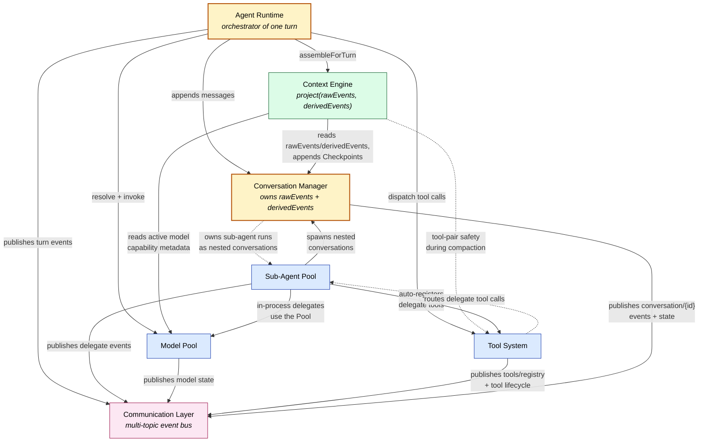
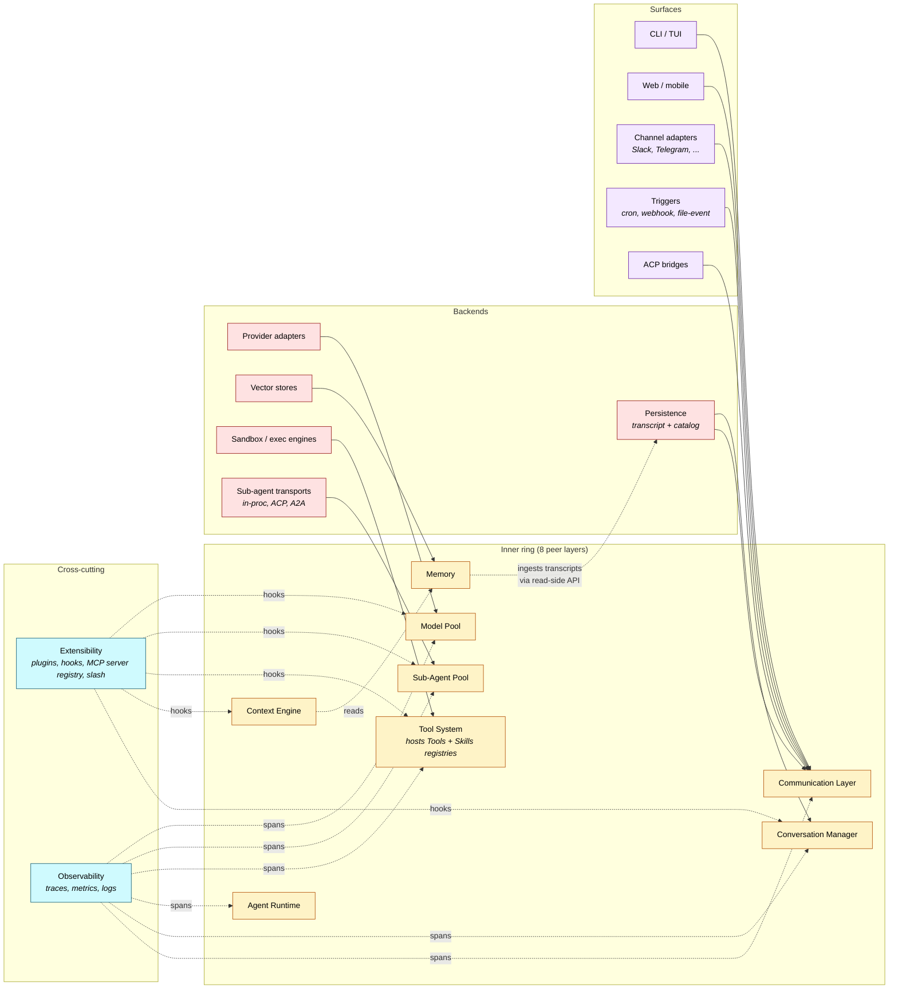

# Layer Dependency Graph

> Layer-level dependency map across the eight inner-ring layers and the auxiliary taxonomy (backends, surfaces, cross-cutting). Anchored in the `consumers / consumes` sections of each layer's README. For the architectural lock-in itself, see [./README.md](./README.md).

## TL;DR

The Agent Runtime is the call hub of the inner ring — every turn fans out to **Context Engine → Model Pool → Tool System** (with Sub-Agent Pool reached *through* Tool System via auto-registered delegate tools). The **Conversation Manager** is the data hub — it owns the conversation resource the Runtime mutates and the Engine reads/writes Checkpoints into. The **Communication Layer** is a strict downstream sink — every other inner-ring layer publishes into it; nothing reads from it. There are exactly two cycles in the inner ring, both intentional: **Tool System ↔ Sub-Agent Pool** (delegate tools), and **Conversation Manager ↔ Sub-Agent Pool** (nested conversations).

The auxiliary tiers fall out cleanly: **backends** are driven by inner-ring layers; **surfaces** consume the Communication Layer only; **cross-cutting** concerns hook across multiple inner-ring layers without sitting in any one. Tools, Skills, and the MCP server registry are not a separate auxiliary bucket — Tools and Skills live under the Tool System (their dispatcher), and the MCP server registry lives under cross-cutting/extensibility (the plugin/hook host that loads them). Memory was promoted to an inner-ring peer layer for the reasons in [./README.md § "Memory as an inner-ring layer"](./README.md).

## Inner-ring dependency graph

**Edge styles:** solid arrows are runtime call dependencies (caller depends on callee); dotted arrows are reverse references that complete a cycle (the two intentional bidirectional pairs).

## Auxiliary tiers

## Edge walkthrough

The inner ring has seven layers that push events into the eighth (the Communication Layer), with two intentional cycles. Going one layer at a time:

### Agent Runtime — the call hub

The runtime is the only layer that reaches into *all* the others. Per [agent-runtime/README.md](./agent-runtime/README.md), one iteration of its loop is `assembleForTurn → resolve → invoke → dispatch → append`, and every verb maps to a peer:

- `assembleForTurn(...)` → **Context Engine**, which projects a message array from `(rawEvents, derivedEvents, config)`. The Engine reads from the conversation, but the runtime is the layer that *calls* the Engine.
- `ModelPool.resolve(...)` then `ModelPool.invoke(...)` → **Model Pool**. Resolve runs every iteration so routing can change mid-turn.
- `ToolSystem.dispatch(...)` → **Tool System**. The runtime sees delegate-class tool calls as ordinary tool calls; the Tool System routes them onward to the Sub-Agent Pool, so the runtime never depends on the Sub-Agent Pool directly.
- `conversation.append(...)` → **Conversation Manager**. Every iteration appends user / assistant / tool-result entries.
- `publish(event)` → **Communication Layer**. The runtime is the producer of `conversation/{id}/events` (turn lifecycle, model deltas, tool dispatch).

The runtime depends on five of the seven other inner-ring layers directly; its dependency on the Sub-Agent Pool is indirect (via the Tool System), and it does not call into Memory directly (the Context Engine handles memory loading at assembly time).

### Context Engine — reads the conversation, writes Checkpoints

Per [context-engine/README.md § "What consumes the Context Engine and what it consumes"](./context-engine/README.md#what-consumes-the-context-engine-and-what-it-consumes):

- **Reads from the Conversation Manager** — both `rawEvents` (source of truth) and `derivedEvents` (its own prior Checkpoints). Also reads conversation state (mode, prompt overrides, attachments, routing, budget).
- **Writes to the Conversation Manager** — Checkpoints into `derivedEvents` via `appendCheckpoint(...)`. The Engine is the *sole* writer of the Checkpoint kinds (CompactionCheckpoint, MemoryInjectionSnapshot, ToolResultTrim, optional SystemPromptAssembly, optional AttachmentDigest). It never writes to `rawEvents`.
- **Reads the active model's capability metadata from the Model Pool** — needed for compaction aggressiveness, prompt-cache breakpoints, attachment inlining policy.
- **Reads the Memory layer** — for cross-conversation knowledge worth injecting at assembly time. Memory is the only inner-ring peer the Context Engine *auto-loads from* without a model invocation; everything else the model sees came in via a tool call result or was generated by the model itself.
- **Reads the Skills registry's index** — names + descriptions only, for the system-prompt listing of available skills. The Skills registry itself is owned by the Tool System (its dispatcher); the Context Engine never loads skill *content* — that arrives via the model invoking the `Skill` tool.
- **Consults the Tool System's tool-pair safety constraints** during compaction, so a `tool_use`/`tool_result` pair is never split across the compaction boundary. The dotted arrow in the inner-ring graph reflects this — it's a constraint consultation, not a runtime call.

### Model Pool — registry + scheduler, talks downward to providers and outward to the bus

Per [model-pool/README.md § "What the Pool publishes"](./model-pool/README.md):

- **Drives provider adapters** internally — they're the wire codec layer underneath, not a peer. Provider adapters live in `backends/providers/`.
- **Publishes `models/registry`, `model/{id}/state`, `pool/health`** plus per-conversation contributions to `conversation/{id}/events` and `conversation/{id}/state` onto the Communication Layer.

The Pool depends on no other inner-ring layer at runtime; it's called by the Runtime, the Context Engine, and the Sub-Agent Pool.

### Sub-Agent Pool — three-Pool sibling, exposed via Tool System

Per [sub-agent-pool/README.md](./sub-agent-pool/README.md) and the architecture lock-in:

- **Auto-registers "delegate" tools into the Tool System** — this is how the model reaches the Pool. From the model's perspective, calling `delegate_to_researcher` is a tool call like any other. This is the first half of the **Tool System ↔ Sub-Agent Pool cycle**: SP registers tools into TS, and TS routes those specific tool calls back to SP for dispatch.
- **In-process adapter spawns nested conversations in the Conversation Manager.** Sub-agent runs are themselves conversations, owned by the Manager. This is the second cycle: SP creates conversations through CM, and CM owns those nested conversations. ([core/README.md § "Memory and the Conversation Manager"](./README.md) and [conversation-manager/README.md](./conversation-manager/README.md).)
- **In-process delegates use the Model Pool** for their own LLM calls — the in-process adapter just runs a nested agent loop, which means a nested Model Pool dispatch.
- **Drives transport adapters** under it (in-process, ACP-stdio, A2A, custom) — these are `backends/`.
- **Publishes delegate lifecycle events** onto the Communication Layer, tagged with trust class.

### Tool System — the gate for side effects

Per [tool-system/README.md § "What consumes the Tool System and what it consumes"](./tool-system/README.md):

- **Consumers:** the Agent Runtime (primary), the Sub-Agent Pool (auto-registers delegate tools), and slash-command surfaces (resolve commands to tool invocations).
- **Reads from registries:** Tools registry (its own) and Skills registry (a Skill bundle can contribute tools).
- **Drives backends:** in-process functions, MCP servers, shell-tool adapters, HTTP/gRPC service adapters, sandbox engines (the `backends/execution-environments/` work).
- **Publishes** `tools/registry` and per-call lifecycle events to the Communication Layer.
- **Routes delegate tool calls back to the Sub-Agent Pool** — the dotted arrow that closes the SP↔TS cycle.

### Conversation Manager — the data hub

Per [conversation-manager/README.md](./conversation-manager/README.md) and [backends/persistence/README.md § "What depends on it"](../backends/persistence/README.md):

- **Owns sub-agent runs as nested conversations** (the SP↔CM cycle).
- **Drives the persistence backend** (transcript JSONL + catalog SQLite). Persistence does not sit between the runtime and the Manager; the Manager owns the contract, persistence is a driver.
- **Publishes `conversation/{id}/events` and `conversation/{id}/state`** onto the Communication Layer — these are the most-subscribed topics in the bus.

The Manager is the convergence point for triggers, channel arrivals, and direct user input — but those arrive *through* the Communication Layer. The Manager doesn't know clients exist.

### Communication Layer — the strict sink

Per [communication-layer/README.md](./communication-layer/README.md):

- **The other six layers publish events into it; none consume from it directly.** Within the inner ring, this is a one-way fanout.
- **The persistence backend's `subscribe` / `latest_sequence` API** drives the Comm Layer's reconcile-and-watch — sequence numbers come from the catalog's `messages.sequence` index. (See persistence § "Per-consumer call patterns" → "Communication Layer".)
- **The catalog's `list_conversations` / `search_messages`** drive the control-plane HTTP endpoints.

### Memory — inner-ring peer layer

Per [core/README.md § "Memory as an inner-ring layer"](./README.md) and [core/memory/README.md](./memory/README.md):

- **The Context Engine reads memory** at assembly time (potentially via a `MemoryInjectionSnapshot` cached in `derivedEvents`). This is the auto-load path — memory is pulled into the prompt without the model invoking it.
- **Agent-driven memory recall** (when present, via `memory_search` / `memory_get`) goes through the Tool System dispatcher like any other tool call; results land in the message log and become context on subsequent turns.
- **Memory has its own backends** (vector stores, plus pluggable backends like `memory-core`/SQLite, `memory-lancedb`, Honcho, QMD).
- **Memory ingests transcripts via the read-side persistence API only** — the dreaming/consolidation pipeline reads conversations, never writes to the conversation store.

Memory is one of the eight inner-ring peer layers — its own subsystem with write-side concerns (consolidation, decay, scoring, ranking). It earned the promotion specifically because it's the one persistent knowledge resource the Context Engine auto-loads on every turn without model invocation, and because its write side is too substantive to bury inside the Context Engine.

## Auxiliary tiers — the routing rules

The four auxiliary buckets each have one consistent rule for how they touch the inner ring:

**Registries are read by inner-ring layers.** Tools, Skills, MCP-servers, and Memory store. Tools and MCP feed the Tool System; Skills feed both the Tool System and the Context Engine; Memory feeds the Memory subsystem (which the Engine reads from). A registry never calls into the inner ring; it gets loaded.

**Backends are driven by inner-ring layers.** Provider adapters under the Model Pool; persistence under the Conversation Manager *and* the Communication Layer (for sequence-based replay); vector stores under Memory; sandbox engines under the Tool System; sub-agent transport adapters under the Sub-Agent Pool. Memory has its own backends (`memory-core`/SQLite, `memory-lancedb`, etc.) and consumes the persistence layer only via the read-side ingestion API — it is *not* a persistence client. Backends are infrastructure — they don't have an opinion about the inner ring.

**Surfaces consume the Communication Layer and only the Communication Layer.** CLI, web, mobile, channel adapters, ACP bridges, triggers (cron / webhook / file-event / channel arrivals). The architectural commitment is that *every* surface enters and exits through one wire format, on one bus, with one subscription model — surfaces don't reach into the inner ring directly. Triggers, channel arrivals, and CLI commands all converge at the Comm Layer as different *trust classes* of the same input envelope.

**Cross-cutting concerns hook across multiple inner-ring layers.** Extensibility (the plugin/hook host) defines hook points across the three Pools, the Context Engine lifecycle, and the Conversation Manager. Observability spans across model calls, tool calls, agent turns, conversation lifecycle, and bus traffic. These aren't layers and they aren't backends — they're meta-mechanisms.

## Sanity checks the graph encodes

- **The runtime is dumb.** It depends on the layers around it; the layers around it don't depend on the runtime. Smarts live in the surrounding layers.
- **The Communication Layer is a strict sink in the inner ring.** Removing it would break wire access; adding to it doesn't change the call graph upstream. This is the right shape because the Comm Layer is the *only* layer that talks to the outside world.
- **There are exactly two cycles, both at architecture-lock-in surfaces:**
  - **Tool System ↔ Sub-Agent Pool** — SP auto-registers delegate tools; TS routes those tool calls back. The cycle is what lets the model see delegation as ordinary tool use.
  - **Conversation Manager ↔ Sub-Agent Pool** — SP spawns nested conversations; CM owns those conversations. The cycle is what makes "sub-agent run = nested conversation" structurally true.
- **Memory is a peer of the Conversation Manager**, not a registry buried inside the Context Engine. Its read path goes through the Engine; its write path is its own.
- **Every surface enters through one door** — the Communication Layer. There is no second public entry point into the harness.

## References

- Inner-ring spine: [./README.md](./README.md)
- Each layer's `consumers / consumes` section is the authoritative source for its outgoing/incoming edges:
  - [agent-runtime/README.md § References](./agent-runtime/README.md) — final list of practical-detail interfaces
  - [context-engine/README.md § "What consumes the Context Engine and what it consumes"](./context-engine/README.md#what-consumes-the-context-engine-and-what-it-consumes)
  - [model-pool/README.md § "What the Pool publishes"](./model-pool/README.md)
  - [sub-agent-pool/README.md](./sub-agent-pool/README.md)
  - [tool-system/README.md § "What consumes the Tool System and what it consumes"](./tool-system/README.md#what-consumes-the-tool-system-and-what-it-consumes)
  - [conversation-manager/README.md](./conversation-manager/README.md)
  - [communication-layer/README.md](./communication-layer/README.md)
- Auxiliary placement is anchored in [./README.md § "Auxiliary taxonomy"](./README.md#auxiliary-taxonomy).
- Backend dependency rollup: [../backends/persistence/README.md § "What depends on it"](../backends/persistence/README.md).
