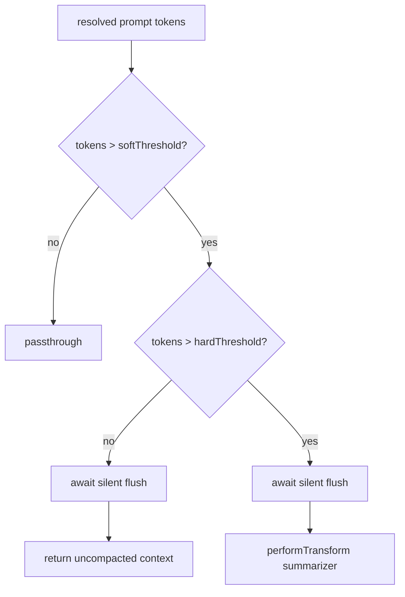

# Memory-aware compaction

Handshake between in-session [compaction](../context-engine/compaction.md) and durable memory: promote important notes out of the conversation **before** the summarizer runs, with enough token headroom for a bounded flush sub-agent.

Drafted for M1 soft-threshold flush. Transcript-byte fallback triggers are **out of scope** (trigger remains the compaction token decision / soft headroom of that decision).

## Handshake overview

| Band | Behavior |
|------|----------|
| Under soft | Passthrough (no flush, no summarizer) |
| Soft fires, hard does not | **Flush-only**: silent memory flush, then return uncompacted context |
| Hard fires (or forced gating) | **Flush then transform**: silent flush, then compaction summarizer |

Soft-flush **dedupe**: after a successful soft flush for a conversation, further soft-band assembles skip re-flush until a hard compaction checkpoint completes or the memory session ends.

## Headroom rationale

Hard proactive threshold (unchanged):

- `effective_context_window = model_context_window − proactiveOutputReserveTokens`
- `proactiveThresholdTokens = effective_context_window − proactiveSafetyBufferTokens`
- Hard fires when `promptTokens > hard`

Soft threshold:

- `softProactiveThresholdTokens = max(1, hard − softThresholdTokens)`
- Soft fires when `promptTokens > soft` and `softThresholdTokens > 0`

Default `softThresholdTokens = 8_000` leaves headroom for a bounded flush sub-agent before the context is critically full. Set `softThresholdTokens: 0` to disable soft flush (flush only on the hard path — prior behavior).

## Config

Dual gate: **both** Context Engine and Memory knobs must allow flush.

| Knob | Surface | Default | Role |
|------|---------|---------|------|
| `contextCompaction.preCompactionMemoryFlushEnabled` | CE / PromptConfig | `true` | CE assemble may run pre-compaction flush |
| `contextCompaction.preCompactionMemoryFlushMaxEntries` | CE | `64` | Cap on flushed entry IDs in the checkpoint snapshot |
| `contextCompaction.softThresholdTokens` | CE | `8_000` | Soft headroom below hard; `0` = soft disabled |
| `memory.preCompactionFlushEnabled` | Memory | `true` | Memory service / spawn path may execute flush |
| `memory.preCompactionFlushTimeoutMs` | Memory | `30_000` | Flush sub-agent timeout |
| `memory.preCompactionFlushMaxIterations` | Memory | `2` | Flush sub-agent iteration bound |
| `memory.preCompactionFlushSystemPromptPath` | Memory | unset | Optional file path for custom flush system prompt body; built-in default when unset |

Loader clamp for `softThresholdTokens`: `max(0, v)` with upper bound `min(100_000, proactiveSafetyBufferTokens * 2)`.

## Enforced safety hints

Operators may replace the flush sub-agent task guidance via `memory.preCompactionFlushSystemPromptPath` (UTF-8 file). The harness **always** injects the live curated manifest and re-appends three non-negotiable safety hints after any custom or default body:

| Hint | Role |
|------|------|
| **Target** | Curated typed topic files only; no daily staging (`YYYY-MM-DD.md`) |
| **Append-only** | Existing manifest topics and `MEMORY.md` index: read first, append via `edit_file` only |
| **Read-only scope** | File tools limited to the memory directory; parallel read-then-write turn budget |

Dual enforcement: hints are prompt-layer guardrails; `PreCompactionFlushWriteGuard` validates `write_file` / `edit_file` at the tool layer during flush.

## Flush write targets (curated only)

Pre-compaction flush promotes durable facts to **curated typed topic files** (`user` / `feedback` / `project` / `reference` with YAML frontmatter). It does **not** target daily staging files (`YYYY-MM-DD.md`) — that tier remains for background extraction and dreaming (C3).

| Target | Flush behavior |
|--------|----------------|
| New typed topic `.md` | `write_file` with valid frontmatter |
| Existing manifest topic | **Append-only** via `edit_file` (read first) |
| `MEMORY.md` | **Append-only** one index hook line via `edit_file` (never `write_file`) |
| Daily staging / `DREAMS.md` / `.dreams/*` | Rejected at tool layer |

Prompt + runtime guard: the flush sub-agent gets a dedicated curated-only prompt (not the extraction/daily-capture prompt). While flush runs, `PreCompactionFlushWriteGuard` validates `write_file` / `edit_file` mutations. Successful flush checkpoints count **validated curated topic** writes only (`MEMORY.md` and daily paths are excluded from entry IDs).

Background extraction may still append to daily staging; only the pre-compaction flush path is curated-only.

## Provider pre-compaction extraction

After optional flush and **before** the compaction summarizer runs, active memory provider(s) receive the raw middle transcript via `onPreCompress(messages)`. Non-empty return values are aggregated (builtin provider first, then external) and injected into the summarizer handoff prompt as `memory_provider_pre_compress_block` — a fenced `<memory-pre-compress>` section the summarizer must treat as authoritative background.

Lifecycle order on the hard compaction path:

1. Optional silent flush sub-agent (promote durable facts to curated topics)
2. Provider `onPreCompress` extraction (return strings only; not invoked during flush)
3. Compaction summarizer LLM handoff

Soft flush-only paths return uncompacted context and do not run provider extraction or the summarizer.

## Flush dedupe (once-per-cycle + context fingerprint)

Pre-compaction flush tracks **per-message ID coverage** and a **middle context fingerprint** for the novel segment within each compaction cycle:

| Mechanism | Role |
|-----------|------|
| Per-message IDs | Skip or narrow flush to messages not yet flushed this cycle; overlapping compaction middles flush **novel messages only** |
| Middle fingerprint | Skip when the exact novel segment hash was already flushed (exact-duplicate guard) |

When the novel middle is empty after ID filtering, or the fingerprint matches a prior flush in the cycle, the flush sub-agent is not spawned.

Cycle boundary: dedupe state clears when a **hard compaction checkpoint persists** or the memory session ends (in-memory only for M5; not replayed from checkpoint events across restart).

Soft-band dedupe (`softPreCompactionFlushCompleted`) still short-circuits repeated soft-only assembles. Hard-path flush reuses the same ID/fingerprint tracker, so a successful soft flush is not duplicated when hard compaction fires on the same middle coverage.

Provider `onPreCompress` extraction uses the same novel middle gate as flush (after flush attempt, before summarizer).

## Observability (deferred)

Cycle visibility today is limited to structured debug logs (`[PreCompactionMemoryFlush]`, `[ContextEngine]` compaction diagnostics) and persisted checkpoint events (`context_compaction_checkpoint`, pre-flush `memory_injection_snapshot`).

**Not wired:** plugin SDK `before_compaction` / `after_compaction` and operator `session:compact:before` / `session:compact:after` (see [extensibility assessment](../../cross-cutting/extensibility/README.md) hook catalogs and [observability](../../cross-cutting/observability/README.md) span attachment).

When implemented, hooks should fire around the **full hard cycle** (optional flush → provider extraction → summarizer → checkpoint) with **sanitized payloads** (conversation id, phase, middle message count, flush/skipped reason, checkpoint kind — not raw middle transcript unless gated by `hooks.allowConversationAccess`). Defer hook-bus implementation to the extensibility assessment (hook taxonomy, decision vs observation typing, priority semantics) and observability exporter attachment.

## Explicitly deferred

- **Transcript-byte fallback** as an alternate flush/compaction trigger (token decision remains authoritative for M1).
- **Cross-session / checkpoint-persisted flush dedupe** (M5 tracker is in-memory per memory session).
- **Plugin-visible compaction hooks** (`before_compaction` / `after_compaction` and operator `session:compact:*`) — pending extensibility assessment; M1–M5 ship without them.

## Related

- [compaction.md](../context-engine/compaction.md) — proactive thresholds, summarizer, re-injection
- [memory.md](./memory.md) — durable memory surfaces and layout
- [pre-reply-recall.md](./pre-reply-recall.md) — active-memory pre-reply (separate from pre-compaction flush)
